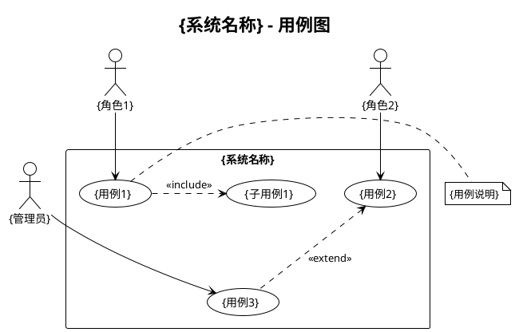
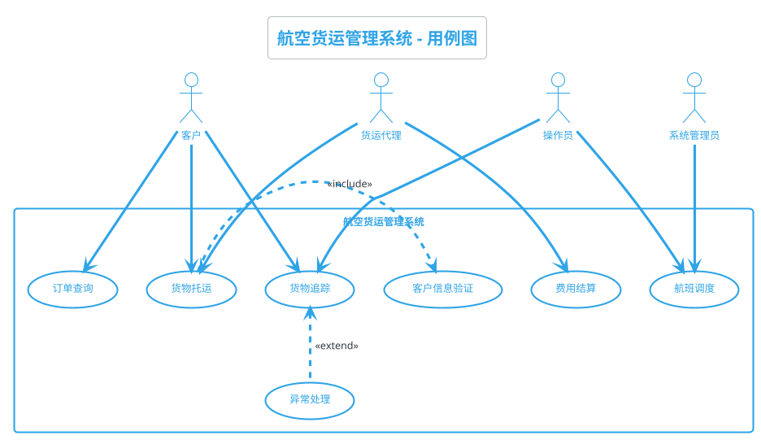
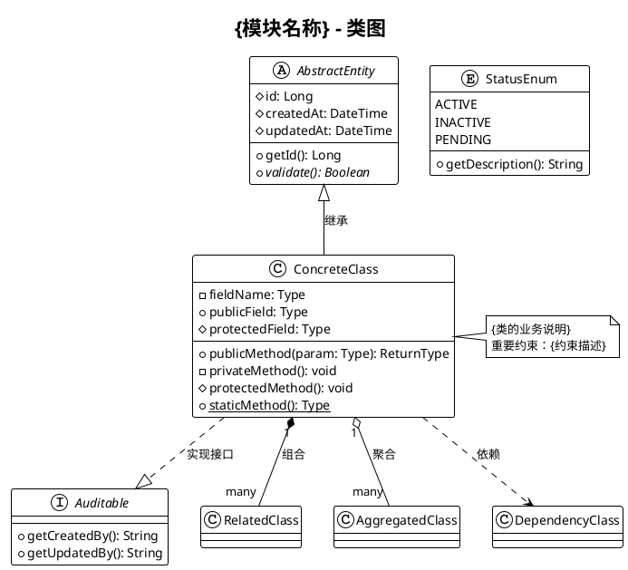
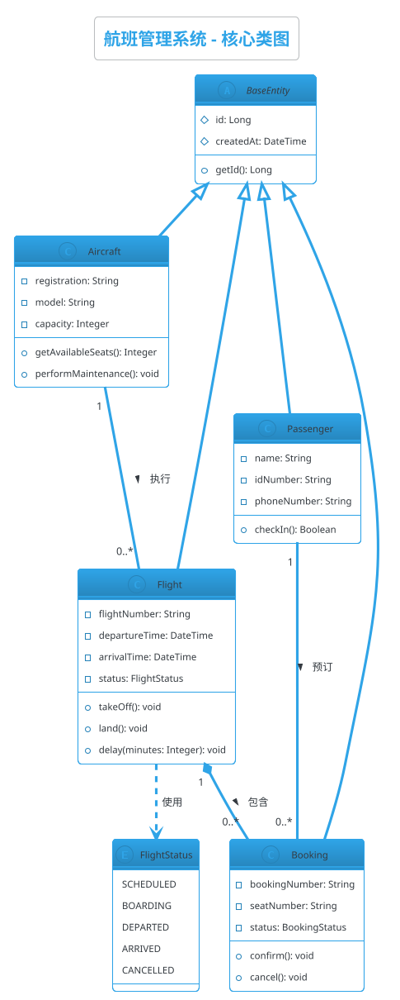
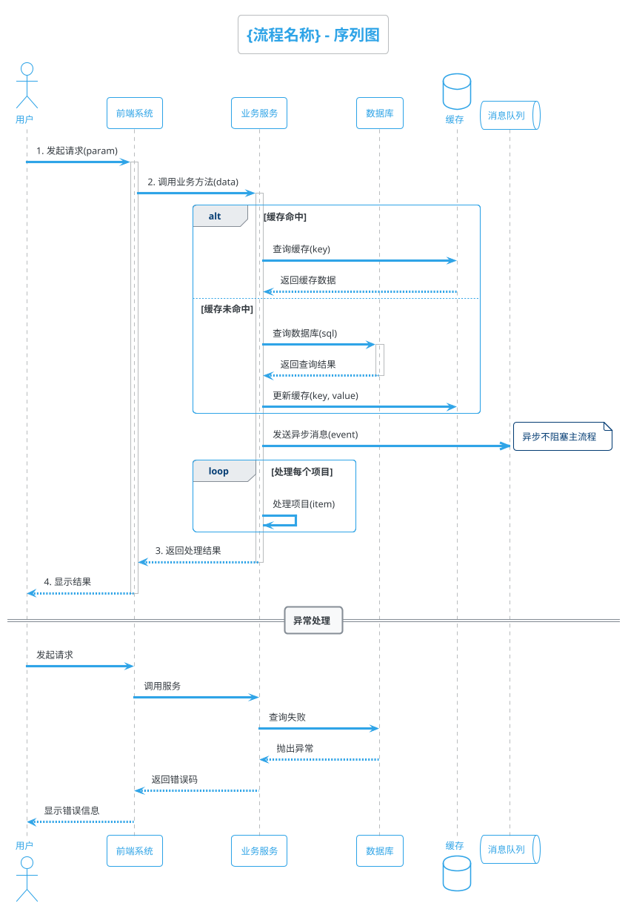
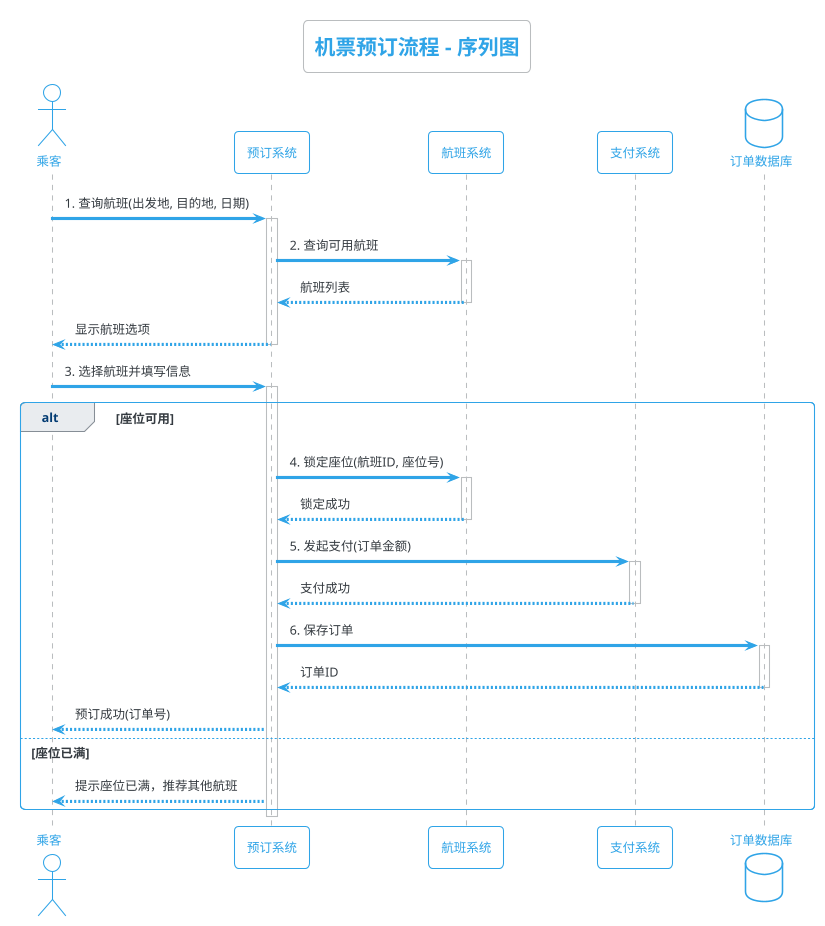

# PlantUML图表绘制提示词集（RTGO框架）

> **📌 文档说明**: 本文档提供12种PlantUML图表的RTGO框架提示词模板，涵盖软件设计全流程的可视化需求。

---

## 📋 文档导航

### 需求分析阶段
1. [用例图 (Use Case Diagram)](#1-用例图-use-case-diagram) - 系统功能和用户角色
2. [思维导图 (Mind Map)](#11-思维导图-mind-map) - 概念梳理和知识结构化

### 系统设计阶段
3. [类图 (Class Diagram)](#2-类图-class-diagram) - 数据模型和类结构
4. [实体关系图 (ER Diagram)](#12-实体关系图-entity-relationship-diagram) - 数据库设计
5. [组件图 (Component Diagram)](#6-组件图-component-diagram) - 系统架构和模块划分
6. [架构图 (Architecture Diagram)](#10-架构图-architecture-diagram) - 技术架构设计

### 详细设计阶段
7. [序列图 (Sequence Diagram)](#3-序列图-sequence-diagram) - 对象交互流程
8. [活动图 (Activity Diagram)](#4-活动图-activity-diagram) - 业务流程建模
9. [状态图 (State Diagram)](#5-状态图-state-diagram) - 对象状态变化

### 部署运维阶段
10. [部署图 (Deployment Diagram)](#7-部署图-deployment-diagram) - 系统部署规划
11. [网络图 (Network Diagram)](#9-网络图-network-diagram) - 网络架构设计
12. [时序图 (Timing Diagram)](#8-时序图-timing-diagram) - 时间约束分析

---

## 🎯 RTGO框架说明

每个图表提示词包含以下4个核心要素：
- **R (Role)**: AI扮演的专业角色
- **T (Task)**: 绘制图表的具体任务
- **G (Goal)**: 绘制图表的目标和价值
- **O (Objective)**: 输出的PlantUML代码要求

---

## 1. 用例图 (Use Case Diagram)

### 🎭 R - 角色定义

你是一位资深需求分析师，拥有10年软件需求工程经验，擅长：

- 用例建模和需求可视化
- PlantUML用例图语法和最佳实践
- 业务流程分析和用户角色识别
- 系统边界定义和范围管理
- UML规范和建模标准

---

### 📋 T - 任务描述

基于以下**系统需求描述**，使用PlantUML绘制用例图。

#### 输入材料

##### 材料1：系统需求描述

```
{这里粘贴系统功能需求、用户角色、业务场景描述}

必须包含：
- 系统名称和核心功能
- 主要用户角色（内部/外部参与者）
- 核心业务场景和用例
- 用例之间的关系（包含、扩展、泛化）
```

#### 任务上下文

- **建模目的**: 需求分析阶段的功能可视化
- **使用场景**: 需求评审、功能演示、开发任务分解
- **规范标准**: 遵循UML 2.5用例图规范

---

### 🎯 G - 目标与意图

#### 核心目标

将系统功能需求转化为清晰、结构化的用例图，支持需求理解和功能沟通。

#### 具体目标

1. **完整性**: 覆盖所有主要用户角色和核心业务场景，不遗漏关键功能
2. **清晰性**: 用例命名准确（动宾结构），关系标识明确（include/extend）
3. **层次性**: 区分主要用例和次要用例，突出核心业务流程
4. **可读性**: 合理布局，避免线条交叉，添加必要的分组和注释

#### 业务价值

- **为产品经理**: 验证需求覆盖完整性，识别遗漏的功能点
- **为开发团队**: 理解系统功能边界，明确开发任务范围
- **为测试团队**: 提供测试场景设计依据，支持用例驱动测试
- **为业务方**: 直观展示系统能做什么，支持需求确认和评审

#### 成功标准

- ✅ 所有主要参与者和核心用例100%覆盖
- ✅ 用例关系（include/extend）准确标识
- ✅ PlantUML代码可直接运行，无语法错误
- ✅ 图表布局清晰，可读性强

---

### 📤 O - 输出要求

#### 1. PlantUML代码结构



#### 2. 质量要求

##### PlantUML语法规范（强制）

- **主题设置**: 使用 `!theme plain` 或 `!theme cerulean-outline`
- **标题**: 使用 `title` 定义清晰的图表标题
- **别名**: 为长名称定义简短别名（如 `as UC1`）
- **关系箭头**: 
  - 参与者到用例: `-->`
  - include关系: `.>`
  - extend关系: `<..`
- **注释**: 使用 `note` 添加重要说明

##### 用例命名规范（强制）

- **格式**: 动词+名词（如"查询订单"、"提交申请"）
- **粒度**: 单个用例代表一个完整的业务目标
- **避免**: 技术实现细节（如"调用API"、"查询数据库"）

##### 关系使用规范（强制）

- **include关系**: 用于必须执行的子用例（如"下单"必须包含"验证库存"）
- **extend关系**: 用于可选的扩展场景（如"查询订单"可扩展为"导出报表"）
- **泛化关系**: 用于角色继承或用例继承

#### 3. 布局规范

- **参与者位置**: 主要用户在左侧，管理员在右侧
- **用例分组**: 相关用例使用 `rectangle` 或 `package` 分组
- **避免交叉**: 合理安排用例位置，减少连线交叉
- **对齐**: 使用 `-up->`, `-down->`, `-left->`, `-right->` 控制方向

#### 4. 特别说明

##### 复杂系统处理

当系统用例超过10个时：
1. **分层绘制**: 绘制系统级用例图 + 模块级详细用例图
2. **使用包**: 用 `package` 将相关用例分组
3. **突出重点**: 用颜色标识核心用例

```plantuml
package "核心业务" #LightBlue {
  usecase "关键用例1" as UC1
}
```

##### 多角色场景

当参与者超过5个时：
1. **角色分组**: 将相似角色归类（如"内部用户"、"外部客户"）
2. **使用继承**: 定义抽象角色，具体角色继承

```plantuml
actor "用户" as User
actor "普通用户" as NormalUser
actor "VIP用户" as VIPUser

NormalUser -up-|> User
VIPUser -up-|> User
```

#### 5. 输出格式

直接输出完整的PlantUML代码，格式如下：

````markdown
## {系统名称}用例图

### PlantUML代码

```plantuml
@startuml
{完整的PlantUML代码}
@enduml
```

### 图表说明

- **参与者**: {列出所有参与者及其职责}
- **核心用例**: {列出核心业务场景}
- **关键关系**: {说明重要的include/extend关系}

### 使用方式

1. 复制上述PlantUML代码
2. 粘贴到PlantUML在线编辑器: https://www.plantuml.com/plantuml/
3. 或在VS Code中安装PlantUML插件预览
````

---

### ✨ 示例：航空货运管理系统

**输入材料**:
```
系统名称：航空货运管理系统
用户角色：客户、货运代理、操作员、系统管理员
核心功能：货物托运、订单查询、货物追踪、费用结算、航班调度
业务规则：托运必须验证客户信息，追踪可扩展异常处理
```

**预期输出**（简化示例）:


---

## 2. 类图 (Class Diagram)

### 🎭 R - 角色定义

你是一位资深面向对象设计专家，拥有12年软件架构经验，擅长：

- 面向对象设计和领域建模
- PlantUML类图语法和高级特性
- 设计模式应用和UML建模
- 数据模型设计和关系映射
- 代码生成和逆向工程

---

### 📋 T - 任务描述

基于以下**系统模块需求**或**领域模型描述**，使用PlantUML绘制类图。

#### 输入材料

##### 材料1：领域模型或模块需求

```
{这里粘贴业务实体描述、数据模型、类结构说明}

必须包含：
- 核心类/实体名称
- 主要属性（字段名、数据类型）
- 核心方法（方法名、参数、返回值）
- 类之间的关系（继承、组合、聚合、依赖）
```

#### 任务上下文

- **建模目的**: 系统设计阶段的类结构可视化
- **使用场景**: 架构设计、代码评审、ORM映射设计
- **详细程度**: 设计级类图（包含属性和方法签名）

---

### 🎯 G - 目标与意图

#### 核心目标

将业务领域模型转化为结构化的面向对象类图，支持系统设计和代码实现。

#### 具体目标

1. **完整性**: 覆盖核心业务实体和关键领域概念，属性和方法定义完整
2. **准确性**: 类关系（继承/组合/聚合/依赖）准确表达业务语义
3. **规范性**: 遵循面向对象设计原则（单一职责、开闭原则等）
4. **可实现性**: 类图可直接转化为代码结构（支持代码生成）

#### 业务价值

- **为架构师**: 验证系统设计合理性，识别设计缺陷和改进点
- **为开发团队**: 提供代码实现蓝图，统一类结构和接口定义
- **为数据库设计**: 提供ORM映射参考，支持数据库表结构设计
- **为代码审查**: 对比设计与实现差异，确保代码符合设计意图

#### 成功标准

- ✅ 核心业务实体100%覆盖，属性和方法定义完整
- ✅ 类关系准确表达业务语义（继承、组合、聚合清晰区分）
- ✅ 遵循UML类图规范，可直接用于代码生成
- ✅ 支持主流ORM框架（JPA/Hibernate/MyBatis）映射

---

### 📤 O - 输出要求

#### 1. PlantUML代码结构



#### 2. 质量要求

##### PlantUML语法规范（强制）

- **可见性修饰符**:
  - `+` public
  - `-` private
  - `#` protected
  - `~` package
- **字段和方法分隔**: 使用 `--` 分隔属性和方法
- **静态成员**: 使用 `{static}` 标识
- **抽象**: `{abstract}` 标识抽象类/方法

##### 关系表达规范（强制）

| 关系类型 | PlantUML语法 | 使用场景 |
|---------|-------------|---------|
| 继承（泛化） | `<|--` | 类继承、接口继承 |
| 实现接口 | `..|>` | 类实现接口 |
| 组合 | `*--` | 强依赖，整体与部分生命周期一致 |
| 聚合 | `o--` | 弱依赖，部分可独立存在 |
| 关联 | `-->` | 一般关联关系 |
| 依赖 | `..>` | 临时依赖（方法参数、局部变量） |

##### 命名规范（强制）

- **类名**: 大驼峰（PascalCase），名词
- **属性**: 小驼峰（camelCase），名词
- **方法**: 小驼峰（camelCase），动词开头
- **常量**: 全大写下划线分隔（UPPER_SNAKE_CASE）

#### 3. 设计原则

- **单一职责**: 每个类职责明确，不承担过多功能
- **开闭原则**: 使用抽象类/接口支持扩展
- **里氏替换**: 子类可替换父类
- **依赖倒置**: 依赖抽象而非具体实现

#### 4. 特别说明

##### 复杂继承层次处理

当继承层次超过3级时：
```plantuml
' 使用分层展示
package "领域层" {
  abstract class DomainEntity
}

package "应用层" {
  class ApplicationEntity extends DomainEntity
}
```

##### 多重性标注

明确关联关系的多重性：
```plantuml
Class1 "1" -- "0..*" Class2 : 关联名称 >
Class1 "1" *-- "1..*" Class3 : 包含 >
```

##### 泛型支持

```plantuml
class Repository<T> {
  + findById(id: Long): T
  + save(entity: T): T
}
```

#### 5. 输出格式

直接输出完整的PlantUML代码，包含必要的注释和说明。

---

### ✨ 示例：航班管理系统类图

（简化示例，完整版包含更多细节）



---

## 3. 序列图 (Sequence Diagram)

### 🎭 R - 角色定义

你是一位资深系统分析师，拥有10年业务流程建模和交互设计经验，擅长：

- 对象交互和消息传递建模
- PlantUML序列图高级语法和最佳实践
- 时序逻辑分析和异步流程设计
- 系统集成和接口交互设计
- 业务流程优化和性能分析

---

### 📋 T - 任务描述

基于以下**业务流程描述**或**用户故事**，使用PlantUML绘制序列图。

#### 输入材料

##### 材料1：业务流程或用户故事

```
{这里粘贴业务流程描述、用户故事、接口交互说明}

必须包含：
- 参与对象（用户、系统、外部服务）
- 主要交互步骤（按时间顺序）
- 消息类型（同步调用、异步消息、返回值）
- 可选流程和异常处理
- 循环和条件分支
```

#### 任务上下文

- **建模目的**: 详细设计阶段的交互流程可视化
- **使用场景**: 接口设计、集成开发、问题排查
- **详细程度**: 方法级交互（包含参数和返回值）

---

### 🎯 G - 目标与意图

#### 核心目标

将业务流程转化为时序清晰的对象交互序列图，支持接口设计和代码实现。

#### 具体目标

1. **时序准确性**: 消息传递顺序符合业务逻辑，异步/同步调用准确标识
2. **完整性**: 覆盖主流程、异常流程、可选分支，不遗漏关键交互
3. **可读性**: 消息命名清晰（方法名+参数），分组和注释合理
4. **可追踪性**: 支持从序列图追溯到代码实现（方法调用链）

#### 业务价值

- **为接口设计**: 明确系统间接口规范，参数和返回值定义
- **为开发团队**: 理解对象协作流程，减少实现偏差
- **为问题排查**: 可视化调用链，快速定位异常环节
- **为性能优化**: 识别同步阻塞点，优化异步调用

#### 成功标准

- ✅ 主流程和关键异常流程100%覆盖
- ✅ 同步/异步调用准确标识，消息参数完整
- ✅ 支持代码生成（方法签名可直接转化为接口定义）
- ✅ 图表可读性强，逻辑清晰

---

### 📤 O - 输出要求

#### 1. PlantUML代码结构



#### 2. 质量要求

##### PlantUML语法规范（强制）

- **同步调用**: `->` 实线箭头，等待返回
- **异步调用**: `->>` 虚线箭头，不等待返回
- **返回消息**: `-->` 虚线返回箭头
- **激活**: `activate`/`deactivate` 标识对象生命周期
- **自调用**: `Object -> Object: method()`

##### 消息命名规范（强制）

```plantuml
' 格式：序号. 方法名(参数): 返回值
Frontend -> Service: 1. getUserInfo(userId): UserDTO
Service -> DB: 2. queryUser(id): UserEntity
DB --> Service: userEntity
Service --> Frontend: userDTO
```

##### 控制结构规范（强制）

| 结构类型 | PlantUML语法 | 使用场景 |
|---------|-------------|---------|
| 条件分支 | `alt/else/end` | if-else逻辑 |
| 可选流程 | `opt/end` | 可选执行的流程 |
| 循环 | `loop/end` | 遍历集合、重试逻辑 |
| 并行 | `par/end` | 并发执行的流程 |
| 分组 | `group/end` | 逻辑分组 |

#### 3. 时序规范

- **从上到下**: 时间从上往下流动
- **编号**: 消息从1开始编号，便于理解顺序
- **分隔**: 使用 `== 标题 ==` 分隔不同场景
- **注释**: 关键步骤添加 `note` 说明

#### 4. 特别说明

##### 复杂流程简化

当交互步骤超过15个时：
1. **分层绘制**: 绘制总体流程图 + 子流程详细图
2. **使用引用**: `ref over` 引用外部图表
3. **省略细节**: 主图只保留关键步骤

```plantuml
ref over Service, DB
  详见"数据查询子流程"
end ref
```

##### 异步消息标识

```plantuml
' 异步调用：使用虚线箭头
Service ->> MQ: 发送消息(event)
note right
  异步调用，不阻塞主流程
  消息异步处理
end note
```

##### 超时和重试

```plantuml
Service -> ExternalAPI: 调用外部接口
note right: 超时时间3秒

alt 调用成功
    ExternalAPI --> Service: 返回结果
else 超时
    loop 重试3次
        Service -> ExternalAPI: 重试调用
    end
end
```

#### 5. 输出格式

直接输出完整的PlantUML代码。

---

### ✨ 示例：机票预订流程



---

## 4. 活动图 (Activity Diagram)

### 🎭 R - 角色定义

你是一位资深业务流程分析师，拥有12年BPM（业务流程管理）经验，擅长：

- 业务流程建模和优化
- PlantUML活动图语法和流程设计
- 工作流引擎（Activiti/Flowable）建模
- 跨部门流程协调和泳道设计
- 流程自动化和RPA设计

---

### 📋 T - 任务描述

基于以下**业务流程描述**，使用PlantUML绘制活动图。

#### 输入材料

##### 材料1：业务流程描述

```
{这里粘贴业务流程说明、操作手册、SOP标准}

必须包含：
- 流程起点和终点
- 主要活动节点（操作步骤）
- 决策点（判断条件）
- 并行活动（可同时执行的步骤）
- 异常处理路径
- 责任人/角色（可选）
```

#### 任务上下文

- **建模目的**: 业务流程可视化和优化分析
- **使用场景**: 流程培训、流程审计、工作流引擎配置
- **详细程度**: 业务活动级（不涉及技术实现细节）

---

### 🎯 G - 目标与意图

#### 核心目标

将复杂业务流程转化为清晰的活动图，支持流程理解、优化和自动化。

#### 具体目标

1. **逻辑完整性**: 覆盖主流程、分支流程、异常流程，无逻辑死锁
2. **决策清晰性**: 判断条件明确可执行，分支路径完整
3. **并行合理性**: 可并行活动准确标识，同步点设置合理
4. **可执行性**: 活动图可直接转化为工作流引擎配置

#### 业务价值

- **为业务部门**: 梳理流程瓶颈，识别优化机会
- **为流程owner**: 明确各环节责任人，支持流程审计
- **为IT团队**: 提供流程自动化设计依据
- **为培训**: 直观展示操作流程，降低培训成本

#### 成功标准

- ✅ 流程覆盖率100%，无遗漏关键步骤
- ✅ 决策条件明确，分支路径完整
- ✅ 支持工作流引擎（Activiti/Flowable）导入
- ✅ 泳道清晰标识责任部门/角色

---

### 📤 O - 输出要求

#### 1. PlantUML代码结构

```plantuml
@startuml {流程名称}活动图
!theme cerulean-outline
title {流程名称} - 活动图

start

' 泳道定义（可选）
|#LightBlue|用户|
:提交申请;

|#LightGreen|系统|
:接收申请;
:验证信息;

' 决策点
if (信息是否完整?) then (是)
  :自动审批;
  
  ' 并行分支
  fork
    :发送通知;
  fork again
    :记录日志;
  end fork
  
else (否)
  :返回补充信息;
  
  ' 循环
  repeat
    |用户|
    :补充信息;
    |系统|
    :重新验证;
  repeat while (信息完整?) is (否)
  
endif

' 嵌套判断
if (审批结果?) then (通过)
  :生成单号;
  :下发权限;
  
  ' 并行处理
  split
    :发送邮件通知;
  split again
    :更新数据库;
  split again
    :同步到第三方;
  end split
  
else (拒绝)
  :记录拒绝原因;
  :通知申请人;
endif

|用户|
:查看结果;

stop

' 异常处理
detach

@enduml
```

#### 2. 质量要求

##### PlantUML语法规范（强制）

- **起止节点**: `start`/`stop`/`end`
- **活动**: `:活动描述;`
- **决策**: `if/then/else/endif`
- **并行**: `fork/fork again/end fork` 或 `split/split again/end split`
- **循环**: `repeat/repeat while`
- **泳道**: `|部门名称|` 或 `|#颜色|部门|`

##### 活动命名规范（强制）

- **格式**: 动宾结构（如"审批申请"、"发送通知"）
- **粒度**: 单个活动代表一个完整操作
- **避免**: 技术实现（如"调用API"、"执行SQL"）

##### 决策条件规范（强制）

```plantuml
if (条件描述?) then (条件为真的标签)
  :活动A;
else (条件为假的标签)
  :活动B;
endif
```

#### 3. 流程设计原则

- **单一入口出口**: 每个流程只有一个start和stop
- **无死锁**: 所有路径最终都能到达终点
- **并行合理**: 真正独立的活动才并行
- **异常处理**: 关键步骤添加异常分支

#### 4. 特别说明

##### 泳道使用

当涉及多个角色/部门时：
```plantuml
|#LightBlue|申请人|
:提交申请;

|#LightGreen|审批人|
:审批申请;

|#LightYellow|系统管理员|
:配置权限;
```

##### 复杂并行

```plantuml
split
  :任务1;
split again
  :任务2;
  if (条件?) then (是)
    :任务2.1;
  else (否)
    :任务2.2;
  endif
split again
  :任务3;
end split

:同步点，等待所有并行任务完成;
```

#### 5. 输出格式

直接输出完整的PlantUML代码。

---

### ✨ 示例：航班安检流程

```plantuml
@startuml 航班安检流程活动图
!theme cerulean-outline
title 航班安检流程 - 活动图

start

|#LightBlue|乘客|
:到达安检口;

|#LightGreen|安检人员|
:检查证件;

if (证件有效?) then (是)
  
  fork
    |安检人员|
    :行李X光检查;
    
    if (发现可疑物品?) then (是)
      :开箱检查;
      
      if (有违禁品?) then (是)
        :扣留物品;
        :记录违规;
        stop
      else (否)
        :通过检查;
      endif
      
    else (否)
      :通过检查;
    endif
    
  fork again
    |安检人员|
    :人身安全检查;
    
    if (需要二次检查?) then (是)
      :加强安检;
    else (否)
      :通过检查;
    endif
    
  end fork
  
  |系统|
  :更新安检状态;
  
  |乘客|
  :前往登机口;
  
else (否)
  |安检人员|
  :拒绝通行;
  :通知相关部门;
  stop
endif

stop

@enduml
```

---

## 5. 状态图 (State Diagram)

### 🎭 R - 角色定义

你是一位资深系统设计师，拥有10年状态机设计和有限状态机建模经验，擅长：

- 对象生命周期和状态转换建模
- PlantUML状态图语法和复杂状态设计
- 状态机模式应用和工作流引擎
- 业务规则引擎和状态驱动设计
- 并发状态和嵌套状态建模

---

### 📋 T - 任务描述

基于以下**对象状态描述**或**业务规则**，使用PlantUML绘制状态图。

#### 输入材料

##### 材料1：对象状态和转换规则

```
{这里粘贴对象状态说明、状态转换条件、业务规则}

必须包含：
- 对象名称（如订单、航班、设备）
- 所有可能状态（初始、中间、最终状态）
- 状态转换条件（触发事件、业务规则）
- 状态内部活动（entry/exit/do）
- 并发状态（可选）
```

#### 任务上下文

- **建模目的**: 对象生命周期和状态转换可视化
- **使用场景**: 状态机实现、业务规则配置、状态流转审计
- **详细程度**: 包含状态内部活动和转换条件

---

### 🎯 G - 目标与意图

#### 核心目标

将对象的完整生命周期转化为状态图，支持状态机代码实现和业务规则配置。

#### 具体目标

1. **完整性**: 覆盖对象所有可能状态，状态转换路径完整
2. **准确性**: 转换条件准确反映业务规则，无非法状态转换
3. **可实现性**: 状态图可直接转化为状态机代码（Spring StateMachine/状态模式）
4. **可审计性**: 状态转换有明确触发条件和责任人

#### 业务价值

- **为开发团队**: 提供状态机实现蓝图，避免遗漏状态转换
- **为测试团队**: 明确状态转换测试用例，覆盖所有状态路径
- **为运营**: 理解业务对象生命周期，优化流程
- **为审计**: 追踪状态变更历史，满足合规要求

#### 成功标准

- ✅ 所有业务状态100%覆盖，转换条件准确
- ✅ 无非法状态转换，无状态孤岛
- ✅ 支持状态机框架（Spring StateMachine）实现
- ✅ 状态内部活动定义完整（entry/exit/do）

---

### 📤 O - 输出要求

#### 1. PlantUML代码结构

```plantuml
@startuml {对象名称}状态图
!theme cerulean-outline
title {对象名称} - 状态图

' 初始状态
[*] --> 状态1 : 创建对象

' 简单状态
state 状态1 {
  状态1 : entry / 进入动作
  状态1 : do / 持续动作
  状态1 : exit / 退出动作
}

' 状态转换
状态1 --> 状态2 : 触发事件 [条件] / 转换动作

' 复合状态（嵌套状态）
state 状态2 {
  [*] --> 子状态1
  子状态1 --> 子状态2 : 子转换
  子状态2 --> [*]
}

' 并发状态
state 并发状态 {
  --
  [*] --> 并发1
  --
  [*] --> 并发2
}

状态2 --> 状态3 : 事件A

' 选择节点
state choice <<choice>>
状态3 --> choice
choice --> 状态4 : [条件1]
choice --> 状态5 : [条件2]

' 最终状态
状态4 --> [*] : 完成
状态5 --> [*] : 取消

' 历史状态
state 状态2 {
  state history <<history,type=deep>>
  history --> 子状态1
}

' 注释
note right of 状态1
  重要说明：
  此状态的特殊规则
end note

@enduml
```

#### 2. 质量要求

##### PlantUML语法规范（强制）

- **初始/最终**: `[*]` 表示起止点
- **状态定义**: `state 状态名`
- **转换**: `状态A --> 状态B : 事件 [条件] / 动作`
- **内部活动**: `entry /`, `do /`, `exit /`
- **并发**: `--` 分隔并发区域

##### 状态命名规范（强制）

- **格式**: 名词或形容词（如"待审批"、"已完成"、"运行中"）
- **避免**: 动词（状态是一种存在，不是动作）
- **一致性**: 同类对象状态命名保持一致

##### 转换条件规范（强制）

```plantuml
' 完整格式：事件 [条件] / 转换动作
状态A --> 状态B : 提交申请 [信息完整] / 发送通知
状态A --> 状态C : 提交申请 [信息不完整] / 返回错误
```

#### 3. 状态设计原则

- **互斥性**: 对象同一时刻只能处于一个状态（并发状态除外）
- **完备性**: 每个状态都有明确的出口
- **可达性**: 所有状态都可从初始状态到达
- **终结性**: 有明确的最终状态

#### 4. 特别说明

##### 复杂状态转换

当转换条件复杂时，使用choice节点：
```plantuml
state choice <<choice>>
审批中 --> choice
choice --> 已通过 : [分数>=80]
choice --> 待复审 : [60<=分数<80]
choice --> 已拒绝 : [分数<60]
```

##### 并发状态

```plantuml
state 订单处理 {
  --
  [*] --> 支付处理
  支付处理 --> 支付完成
  --
  [*] --> 物流处理
  物流处理 --> 物流完成
}
```

##### 历史状态

```plantuml
state 运行中 {
  state history <<history,type=deep>>
  [*] --> 正常运行
  正常运行 --> 处理中 : 处理任务
}

运行中 --> 暂停 : 暂停
暂停 --> 运行中 : 恢复\n(返回暂停前的子状态)
```

#### 5. 输出格式

直接输出完整的PlantUML代码。

---

### ✨ 示例：航班状态图

```plantuml
@startuml 航班状态图
!theme cerulean-outline
title 航班状态 - 状态图

[*] --> 计划中 : 创建航班

state 计划中 {
  计划中 : entry / 分配航班号
  计划中 : do / 接收预订
}

计划中 --> 准备中 : 起飞前2小时 / 开始值机

state 准备中 {
  准备中 : entry / 通知地勤
  准备中 : do / 乘客值机
  准备中 : exit / 关闭值机
}

准备中 --> 登机中 : 起飞前45分钟

state 登机中 {
  登机中 : entry / 开放登机口
  登机中 : do / 乘客登机
  登机中 : exit / 关闭舱门
}

state choice <<choice>>
登机中 --> choice : 登机完成

choice --> 起飞 : [天气正常]
choice --> 延误 : [天气异常]

延误 --> 起飞 : 天气转好
延误 --> 取消 : 长时间延误

起飞 --> 飞行中 : 离地 / 更新位置

state 飞行中 {
  飞行中 : do / 持续更新位置
}

飞行中 --> 降落 : 到达目的地

降落 --> 完成 : 停稳 / 乘客下机

完成 --> [*]
取消 --> [*]

note right of 延误
  延误超过4小时
  触发退票流程
end note

@enduml
```

---

## 6. 组件图 (Component Diagram)

### 🎭 R - 角色定义

你是一位资深软件架构师，拥有15年大型系统架构设计经验，擅长：

- 微服务架构和组件化设计
- PlantUML组件图语法和架构建模
- 接口设计和依赖管理（DDD/六边形架构）
- 系统解耦和模块化设计
- 技术选型和架构决策记录（ADR）

---

### 📋 T - 任务描述

基于以下**系统架构描述**或**模块划分方案**，使用PlantUML绘制组件图。

#### 输入材料

##### 材料1：系统架构或模块说明

```
{这里粘贴系统架构文档、模块划分方案、服务清单}

必须包含：
- 系统组件/模块列表（服务、子系统、模块）
- 组件提供的接口（API/端点）
- 组件依赖的接口（外部服务、数据库）
- 组件分组/分层（可选）
- 通信协议（REST/gRPC/消息队列）
```

#### 任务上下文

- **建模目的**: 系统架构可视化和组件依赖分析
- **使用场景**: 架构评审、技术选型、系统重构
- **详细程度**: 逻辑组件级（不涉及物理部署）

---

### 🎯 G - 目标与意图

#### 核心目标

将系统架构转化为清晰的组件图，支持架构分析、依赖管理和技术决策。

#### 具体目标

1. **完整性**: 覆盖系统所有核心组件，接口定义完整
2. **层次性**: 体现系统分层（展现层/业务层/数据层）或分域（DDD边界上下文）
3. **依赖清晰**: 组件依赖方向准确，避免循环依赖
4. **可演进性**: 支持架构演进分析（单体→微服务）

#### 业务价值

- **为架构师**: 识别架构风险（紧耦合、循环依赖），优化架构设计
- **为技术leader**: 明确服务边界，指导团队划分和接口设计
- **为开发团队**: 理解系统全局，减少跨组件集成问题
- **为技术委员会**: 评审架构合理性，支持技术选型决策

#### 成功标准

- ✅ 系统组件100%覆盖，接口定义完整
- ✅ 依赖关系准确，无循环依赖
- ✅ 遵循架构原则（高内聚、低耦合、单向依赖）
- ✅ 支持架构演进路径分析

---

### 📤 O - 输出要求

#### 1. PlantUML代码结构

```plantuml
@startuml {系统名称}组件图
!theme cerulean-outline
title {系统名称} - 组件图

' 包/分层定义
package "展现层" {
  [Web前端] as WebUI
  [移动端] as MobileUI
  
  interface "HTTP API" as API
}

package "业务层" {
  package "订单域" {
    [订单服务] as OrderService
    [支付服务] as PaymentService
  }
  
  package "用户域" {
    [用户服务] as UserService
    [认证服务] as AuthService
  }
  
  ' 组件提供的接口
  interface "REST API" as RestAPI
  OrderService - RestAPI
  
  ' 组件依赖的接口
  interface "消息队列" as MQ
}

package "数据层" {
  database "订单数据库" as OrderDB
  database "用户数据库" as UserDB
  queue "Kafka" as Kafka
}

' 组件之间的依赖
WebUI ..> API : 使用
MobileUI ..> API : 使用

API --> RestAPI : 调用

OrderService --> PaymentService : 依赖
OrderService --> UserService : 依赖
OrderService --> OrderDB : 读写
OrderService ..> MQ : 发布事件

PaymentService --> Kafka : 发布
UserService --> UserDB : 读写

' 外部系统
cloud "外部服务" {
  [支付网关] as PaymentGateway
  [短信服务] as SMS
}

PaymentService ..> PaymentGateway : 调用
AuthService ..> SMS : 调用

' 注释
note right of OrderService
  核心业务组件
  处理订单全生命周期
end note

note as N1
  <b>架构说明</b>
  ----
  - 分层架构：展现层/业务层/数据层
  - 业务层按DDD划分边界上下文
  - 组件间通过接口解耦
  - 异步通信使用消息队列
end note

@enduml
```

#### 2. 质量要求

##### PlantUML语法规范（强制）

- **组件**: `[组件名]` 或 `component "组件名" as Alias`
- **接口**: `interface "接口名" as Alias`
- **包**: `package "包名" {}`
- **依赖**: `-->` 实线（强依赖），`..>` 虚线（弱依赖）
- **提供接口**: `组件 - 接口`（棒棒糖记号）
- **依赖接口**: `组件 ..> 接口`（插座记号）

##### 组件命名规范（强制）

- **格式**: 名词+服务/系统/模块（如"订单服务"、"支付网关"）
- **粒度**: 单一职责的逻辑单元
- **一致性**: 同一层次组件粒度保持一致

##### 依赖关系规范（强制）

| 关系类型 | PlantUML语法 | 使用场景 |
|---------|-------------|---------|
| 强依赖 | `-->` | 直接调用（REST API） |
| 弱依赖 | `..>` | 间接依赖（消息队列、配置） |
| 提供接口 | `组件 - 接口` | 对外暴露API |
| 依赖接口 | `组件 ..> 接口` | 依赖外部接口 |

#### 3. 架构设计原则

- **高内聚**: 相关组件放在同一个包内
- **低耦合**: 组件通过接口交互，不直接依赖实现
- **单向依赖**: 依赖方向从上到下（展现层→业务层→数据层）
- **无循环依赖**: 检查依赖图，避免A→B→A的循环

#### 4. 特别说明

##### 微服务架构

```plantuml
package "订单域" {
  [订单服务] as Order
  database "订单DB" as OrderDB
  Order --> OrderDB
}

package "库存域" {
  [库存服务] as Inventory
  database "库存DB" as InventoryDB
  Inventory --> InventoryDB
}

' 服务间通过API网关或消息队列通信
[API网关] as Gateway
Gateway ..> Order : 路由
Gateway ..> Inventory : 路由

queue "事件总线" as EventBus
Order ..> EventBus : 发布订单事件
Inventory ..> EventBus : 订阅订单事件
```

##### 六边形架构（端口适配器）

```plantuml
package "核心业务" {
  [业务逻辑] as Core
  
  interface "入站端口" as InPort
  interface "出站端口" as OutPort
  
  InPort - Core
  Core - OutPort
}

package "适配器层" {
  [REST控制器] as RestAdapter
  [gRPC服务] as GrpcAdapter
  [数据库适配器] as DBAdapter
  [消息队列适配器] as MQAdapter
}

RestAdapter ..> InPort
GrpcAdapter ..> InPort
OutPort ..> DBAdapter
OutPort ..> MQAdapter
```

##### 复杂依赖标注

```plantuml
[订单服务] --> [用户服务] : <<REST>>
[订单服务] ..> [消息队列] : <<异步>>
[订单服务] --> [支付网关] : <<HTTPS>>\n超时3秒
```

#### 5. 输出格式

直接输出完整的PlantUML代码。

---

### ✨ 示例：航空货运管理系统组件图

```plantuml
@startuml 航空货运管理系统组件图
!theme cerulean-outline
title 航空货运管理系统 - 组件图

package "展现层" {
  [Web管理后台] as WebAdmin
  [移动端APP] as MobileApp
  [客户门户] as CustomerPortal
}

package "API网关层" {
  [API网关] as APIGateway
  interface "HTTP/REST" as HttpAPI
  
  APIGateway - HttpAPI
}

package "业务服务层" {
  package "订单域" {
    [订单管理服务] as OrderService
    [运费计算服务] as PriceService
    
    interface "订单API" as OrderAPI
    OrderService - OrderAPI
  }
  
  package "运输域" {
    [运输管理服务] as TransportService
    [航班调度服务] as FlightScheduleService
    
    interface "运输API" as TransportAPI
    TransportService - TransportAPI
  }
  
  package "仓储域" {
    [仓库管理服务] as WarehouseService
    [库存服务] as InventoryService
  }
  
  package "客户域" {
    [客户管理服务] as CustomerService
    [认证授权服务] as AuthService
  }
}

package "数据层" {
  database "订单数据库" as OrderDB
  database "运输数据库" as TransportDB
  database "仓储数据库" as WarehouseDB
  database "客户数据库" as CustomerDB
  
  queue "消息队列\n(Kafka)" as MQ
  database "缓存\n(Redis)" as Cache
}

package "外部系统" {
  cloud "支付网关" as PaymentGateway
  cloud "短信服务" as SMS
  cloud "航司系统" as AirlineSystem
}

' 展现层依赖
WebAdmin ..> HttpAPI : HTTPS
MobileApp ..> HttpAPI : HTTPS
CustomerPortal ..> HttpAPI : HTTPS

' API网关路由
APIGateway ..> OrderAPI : 路由
APIGateway ..> TransportAPI : 路由

' 业务服务依赖
OrderService --> PriceService : 调用
OrderService --> CustomerService : 验证客户
OrderService --> TransportService : 创建运单
OrderService --> OrderDB : 读写

TransportService --> FlightScheduleService : 查询航班
TransportService --> WarehouseService : 分配仓库
TransportService --> TransportDB : 读写
TransportService ..> MQ : 发布运输事件

WarehouseService --> InventoryService : 查库存
WarehouseService --> WarehouseDB : 读写

CustomerService --> AuthService : 认证
CustomerService --> CustomerDB : 读写
CustomerService ..> Cache : 缓存用户信息

' 外部系统依赖
OrderService ..> PaymentGateway : 支付
AuthService ..> SMS : 发送验证码
FlightScheduleService ..> AirlineSystem : 获取航班信息

' 异步通信
OrderService ..> MQ : 发布订单事件
WarehouseService ..> MQ : 订阅订单事件

note right of OrderService
  <b>订单管理服务</b>
  ----
  职责：
  - 订单全生命周期管理
  - 协调运输和仓储
  - 集成支付网关
end note

note as N1
  <b>架构说明</b>
  ----
  • 微服务架构，按DDD划分边界上下文
  • API网关统一入口，路由到后端服务
  • 服务间通过REST API同步调用
  • 异步事件通过Kafka传递
  • Redis缓存热点数据
end note

@enduml
```

---

## 7. 部署图 (Deployment Diagram)

### 🎭 R - 角色定义

你是一位资深DevOps架构师，拥有12年云原生架构和容器化部署经验，擅长：

- 容器编排（Kubernetes/Docker）和云平台架构
- PlantUML部署图语法和基础设施建模
- 高可用架构和容灾设计
- 网络拓扑和安全区域规划
- CI/CD流水线和部署策略

---

### 📋 T - 任务描述

基于以下**系统部署方案**，使用PlantUML绘制部署图。

#### 输入材料

##### 材料1：部署架构说明

```
{这里粘贴部署方案、基础设施清单、容器编排配置}

必须包含：
- 物理/虚拟节点（服务器、容器、云服务）
- 部署的组件/应用（服务实例、数据库、中间件）
- 节点间通信协议（HTTP/gRPC/TCP）
- 网络区域划分（DMZ/应用区/数据区）
- 高可用配置（负载均衡、主从复制）
```

#### 任务上下文

- **建模目的**: 系统物理部署架构可视化
- **使用场景**: 容量规划、运维部署、安全评审
- **详细程度**: 包含网络、存储、计算资源配置

---

### 🎯 G - 目标与意图

#### 核心目标

将系统部署架构转化为清晰的部署图，支持基础设施规划和运维实施。

#### 具体目标

1. **完整性**: 覆盖所有物理节点、部署组件、网络拓扑
2. **准确性**: 通信协议、端口、网络区域准确标识
3. **可实施性**: 部署图可直接转化为基础设施代码（Terraform/K8s YAML）
4. **高可用性**: 体现负载均衡、故障转移、容灾备份

#### 业务价值

- **为运维团队**: 提供部署蓝图，指导环境搭建和变更
- **为架构师**: 评估资源容量，规划扩容方案
- **为安全团队**: 识别网络边界，评审安全策略
- **为成本控制**: 分析资源使用，优化基础设施成本

#### 成功标准

- ✅ 部署节点和组件100%覆盖
- ✅ 网络拓扑和安全区域准确
- ✅ 支持基础设施即代码（IaC）实现
- ✅ 高可用架构体现清晰

---

### 📤 O - 输出要求

#### 1. PlantUML代码结构

```plantuml
@startuml {系统名称}部署图
!theme cerulean-outline
title {系统名称} - 部署图

' 网络区域定义
package "DMZ区" {
  node "负载均衡器" as LB {
    artifact "Nginx\n1.20" as Nginx
  }
  
  node "Web服务器集群" {
    node "Web-1" as Web1 {
      artifact "前端应用\nv1.0" as FrontendApp1
    }
    
    node "Web-2" as Web2 {
      artifact "前端应用\nv1.0" as FrontendApp2
    }
  }
}

package "应用区" {
  node "Kubernetes集群" as K8s {
    node "Master节点" as K8sMaster {
      component "API Server" as APIServer
      component "Scheduler" as Scheduler
    }
    
    node "Worker节点1" as Worker1 {
      artifact "订单服务\nPod×3" as OrderPod1
      artifact "支付服务\nPod×2" as PaymentPod1
    }
    
    node "Worker节点2" as Worker2 {
      artifact "订单服务\nPod×3" as OrderPod2
      artifact "用户服务\nPod×2" as UserPod
    }
  }
}

package "数据区" {
  node "数据库主从" {
    database "MySQL主库" as MySQLMaster {
    }
    
    database "MySQL从库1" as MySQLSlave1 {
    }
    
    database "MySQL从库2" as MySQLSlave2 {
    }
  }
  
  node "缓存集群" {
    database "Redis\nMaster" as RedisMaster
    database "Redis\nSlave" as RedisSlave
  }
  
  node "消息队列" as MQNode {
    queue "Kafka\nCluster" as Kafka
  }
}

' 通信关系
LB --> Web1 : HTTP/80
LB --> Web2 : HTTP/80

Web1 --> APIServer : HTTPS/443
Web2 --> APIServer : HTTPS/443

APIServer --> Worker1 : gRPC/6443
APIServer --> Worker2 : gRPC/6443

OrderPod1 --> MySQLMaster : TCP/3306
OrderPod2 --> MySQLMaster : TCP/3306
OrderPod1 --> RedisMaster : TCP/6379
OrderPod2 --> RedisMaster : TCP/6379

PaymentPod1 --> Kafka : TCP/9092
UserPod --> MySQLMaster : TCP/3306

MySQLMaster -down-> MySQLSlave1 : 主从复制
MySQLMaster -down-> MySQLSlave2 : 主从复制

RedisMaster -down-> RedisSlave : 主从复制

' 外部系统
cloud "外部服务" {
  node "支付网关" as PaymentGW
}

PaymentPod1 ..> PaymentGW : HTTPS/443

note right of K8s
  <b>K8s集群配置</b>
  ----
  • 1个Master节点（HA生产需3个）
  • 2个Worker节点
  • 每个Pod限制：CPU 2核，内存4GB
  • HPA自动扩缩容：3-10个Pod
end note

note as N1
  <b>部署说明</b>
  ----
  • DMZ区：公网访问，Nginx做负载均衡
  • 应用区：Kubernetes管理微服务
  • 数据区：内网隔离，1主2从高可用
  • 网络策略：DMZ → 应用区 → 数据区单向访问
end note

@enduml
```

#### 2. 质量要求

##### PlantUML语法规范（强制）

- **节点**: `node "节点名" as Alias {}`
- **组件**: `component "组件名"`
- **制品**: `artifact "应用名\n版本"`
- **数据库**: `database "数据库名"`
- **消息队列**: `queue "队列名"`
- **通信**: `-->` 标注协议和端口

##### 节点命名规范（强制）

```plantuml
node "Web服务器-01\n(192.168.1.10)" as Web1 {
  artifact "Nginx 1.20\n8核16GB" as Nginx
}
```

##### 通信协议规范（强制）

```plantuml
' 格式：协议/端口
Web --> App : HTTPS/443
App --> DB : TCP/3306
Service --> MQ : Kafka/9092
```

#### 3. 部署设计原则

- **网络分区**: DMZ区（公网）、应用区（内网）、数据区（隔离）
- **高可用**: 负载均衡、主从复制、多副本部署
- **安全性**: 最小权限、网络隔离、加密通信
- **可扩展**: 水平扩展（Pod副本）、垂直扩展（资源配额）

#### 4. 特别说明

##### 云原生部署

```plantuml
cloud "阿里云" {
  node "VPC\n(192.168.0.0/16)" {
    node "公网SLB" as SLB
    
    package "可用区A" {
      node "ECS-1" as ECS1
    }
    
    package "可用区B" {
      node "ECS-2" as ECS2
    }
    
    database "RDS MySQL\n(主备)" as RDS
  }
}

SLB --> ECS1
SLB --> ECS2
ECS1 --> RDS
ECS2 --> RDS
```

##### 容器编排

```plantuml
node "Kubernetes集群" {
  node "Namespace: production" {
    artifact "订单服务\nDeployment\nreplicas: 3" as OrderDeploy
    artifact "ConfigMap" as Config
    artifact "Secret" as Secret
  }
  
  OrderDeploy ..> Config : 挂载
  OrderDeploy ..> Secret : 挂载
  
  database "PVC\n(持久卷)" as PVC
  OrderDeploy --> PVC : 存储
}
```

##### 混合云部署

```plantuml
cloud "本地IDC" {
  node "应用服务器" as OnPremApp
  database "核心数据库" as OnPremDB
}

cloud "AWS" {
  node "EC2实例" as EC2
  database "S3存储" as S3
}

OnPremApp --> OnPremDB : 内网
OnPremApp ..> EC2 : VPN隧道
EC2 --> S3 : 对象存储
```

#### 5. 输出格式

直接输出完整的PlantUML代码，包含资源配置注释。

---

### ✨ 示例:航班调度系统部署图

```plantuml
@startuml 航班调度系统部署图
!theme cerulean-outline
title 航班调度系统 - 部署图

package "DMZ区 (公网可访问)" {
  node "阿里云SLB\n(负载均衡)" as SLB {
  }
  
  node "Web服务器集群" {
    node "Web-01\n(4核8GB)" as Web1 {
      artifact "Vue前端\nv2.1.0" as Frontend1
    }
    
    node "Web-02\n(4核8GB)" as Web2 {
      artifact "Vue前端\nv2.1.0" as Frontend2
    }
  }
}

package "应用区 (内网)" {
  node "ACK Kubernetes集群" as ACK {
    node "Namespace: flight-system" {
      artifact "调度服务\nPod×5\n(2核4GB)" as SchedulePod
      artifact "航班服务\nPod×3\n(2核4GB)" as FlightPod
      artifact "通知服务\nPod×2\n(1核2GB)" as NotifyPod
      
      component "Ingress\nController" as Ingress
    }
  }
  
  node "API网关\n(4核8GB)" as APIGateway {
    artifact "Kong\nv2.8" as Kong
  }
}

package "数据区 (隔离)" {
  node "数据库集群" {
    database "RDS MySQL\n主库\n(8核32GB)" as MySQLMaster
    database "RDS MySQL\n只读实例1" as MySQLSlave1
    database "RDS MySQL\n只读实例2" as MySQLSlave2
  }
  
  node "缓存集群" {
    database "Redis主\n(4核16GB)" as RedisMaster
    database "Redis从\n(4核16GB)" as RedisSlave
  }
  
  node "消息中间件" {
    queue "RocketMQ\n(3节点集群)" as MQ
  }
  
  node "时序数据库" {
    database "InfluxDB\n监控指标" as InfluxDB
  }
}

cloud "外部系统" {
  node "民航总局\n航班数据" as CAAC
  node "气象服务\nAPI" as Weather
  node "短信网关" as SMS
}

' 网络通信
SLB --> Web1 : HTTP/80\nHTTPS/443
SLB --> Web2 : HTTP/80\nHTTPS/443

Web1 --> Kong : HTTPS/443
Web2 --> Kong : HTTPS/443

Kong --> Ingress : HTTP/80

Ingress --> SchedulePod : gRPC/50051
Ingress --> FlightPod : gRPC/50052
Ingress --> NotifyPod : gRPC/50053

SchedulePod --> MySQLMaster : TCP/3306
FlightPod --> MySQLMaster : TCP/3306
SchedulePod --> MySQLSlave1 : 只读查询/3306
FlightPod --> MySQLSlave2 : 只读查询/3306

SchedulePod --> RedisMaster : TCP/6379
FlightPod --> RedisMaster : TCP/6379

SchedulePod --> MQ : TCP/9876
NotifyPod --> MQ : TCP/9876

SchedulePod --> InfluxDB : HTTP/8086

MySQLMaster -down-> MySQLSlave1 : 主从复制
MySQLMaster -down-> MySQLSlave2 : 主从复制
RedisMaster -down-> RedisSlave : 主从复制

SchedulePod ..> CAAC : HTTPS/443
SchedulePod ..> Weather : HTTPS/443
NotifyPod ..> SMS : HTTP/80

note right of ACK
  <b>ACK集群配置</b>
  ----
  • 3个Worker节点
  • HPA：CPU>70%自动扩容
  • 调度服务：3-10个Pod
  • 航班服务：2-8个Pod
  • 每日定时扩容：06:00-22:00
end note

note as N1
  <b>高可用架构说明</b>
  ----
  • SLB多可用区部署（杭州A+B）
  • RDS MySQL一主二从读写分离
  • Redis哨兵模式自动故障转移
  • RocketMQ 3节点集群（至少2节点可用）
  • K8s Pod跨节点调度
  
  <b>容灾策略</b>
  ----
  • RTO: 15分钟
  • RPO: 5分钟（MySQL binlog实时复制）
  • 异地备份：每日23:00备份到OSS
end note

note as N2
  <b>网络安全</b>
  ----
  • DMZ区：公网IP，WAF防护
  • 应用区：内网VPC，安全组限制
  • 数据区：白名单访问，数据加密
  • 访问链路：公网 → SLB → VPC → K8s
end note

@enduml
```

---

## 8. 时序图 (Timing Diagram)

### 🎭 R - 角色定义

你是一位资深实时系统设计师，拥有10年嵌入式和实时系统开发经验，擅长：

- 时间约束分析和实时性能建模
- PlantUML时序图（Timing Diagram）语法
- 并发控制和时间窗口设计
- 系统性能优化和延迟分析
- SLA/SLO指标定义和监控

---

### 📋 T - 任务描述

基于以下**时间约束需求**，使用PlantUML绘制时序图（Timing Diagram）。

#### 输入材料

##### 材料1：时间约束和性能要求

```
{这里粘贴性能需求、时间约束、SLA指标}

必须包含：
- 参与对象/组件
- 关键时间点（T-N、T+N）
- 时间约束（超时、截止时间、时间窗口）
- 状态持续时长
- 并发/并行的时间要求
```

#### 任务上下文

- **建模目的**: 时间敏感流程的时序分析
- **使用场景**: 性能优化、SLA验证、实时系统设计
- **详细程度**: 精确到秒级或毫秒级时间刻度

---

### 🎯 G - 目标与意图

#### 核心目标

将时间约束需求转化为精确的时序图，支持性能分析和SLA验证。

#### 具体目标

1. **时间准确性**: 时间刻度精确，关键时间点准确标注
2. **约束可视化**: 超时、截止时间、时间窗口清晰展示
3. **状态完整性**: 对象状态变化和持续时长准确
4. **可验证性**: 支持SLA/SLO指标验证和性能测试

#### 业务价值

- **为性能工程师**: 识别性能瓶颈，优化时间敏感路径
- **为测试团队**: 设计性能测试用例，验证时间约束
- **为运维**: 配置超时告警，监控SLA指标
- **为业务**: 评估服务质量，优化用户体验

#### 成功标准

- ✅ 时间约束100%量化，关键时间点准确
- ✅ 状态持续时长符合实际业务需求
- ✅ 支持性能测试用例生成
- ✅ SLA指标可追踪验证

---

### 📤 O - 输出要求

#### 1. PlantUML代码结构

```plantuml
@startuml {场景名称}时序图
!theme cerulean-outline
title {场景名称} - 时序图（Timing Diagram）

' 时钟刻度定义
clock "系统时钟" as CLK with period 1000

' 参与对象的状态
robust "航班" as Flight
concise "登机口" as Gate
binary "舱门" as Door

' 时间轴刻度（秒）
@0
Flight is 准备中
Gate is 空闲
Door is 开启

@120
Flight is 开始登机
Gate is 使用中
note right: T-120分钟\n开始值机

@180
Flight is 登机中

@210
Flight is 等待关门
Gate is 清理中
note right: T-30分钟\n停止登机

@220
Door is 关闭
note right: 舱门关闭\n准备推出

@240
Flight is 滑行
Gate is 空闲

' 时间约束标注
@120 <-> @210 : 登机时长90分钟
@210 <-> @240 : 推出准备30分钟

' 状态持续时长
highlight 120 to 210 #LightGreen : 登机窗口
highlight 210 to 220 #LightYellow : 关门窗口
highlight 220 to 240 #LightBlue : 推出准备

@enduml
```

#### 2. 质量要求

##### PlantUML语法规范（强制）

- **状态类型**:
  - `robust`: 多状态对象（3+个状态）
  - `concise`: 紧凑多状态（适合简单状态）
  - `binary`: 二态对象（开/关）
- **时间点**: `@时间值` 定义时间刻度
- **状态**: `对象 is 状态` 定义对象在某时间点的状态
- **时间约束**: `@t1 <-> @t2 : 说明` 标注时间段

##### 时间刻度规范（强制）

```plantuml
' 相对时间（秒）
@0
@30
@60

' 绝对时间
@2024-01-01T08:00:00
@2024-01-01T08:30:00

' 时间段标注
@0 <-> @30 : 处理时长30秒
```

##### 状态命名规范（强制）

- **格式**: 名词或形容词（如"运行中"、"空闲"、"故障"）
- **一致性**: 同一对象的状态命名风格一致
- **清晰性**: 状态语义明确，避免歧义

#### 3. 时序设计原则

- **时间精度**: 根据场景选择合适精度（秒/毫秒/分钟）
- **关键点**: 标注SLA关键时间点
- **约束**: 突出显示时间窗口和超时限制
- **可读性**: 合理分组，避免状态过于密集

#### 4. 特别说明

##### SLA指标标注

```plantuml
robust "API响应" as API

@0
API is 空闲

@50
API is 处理中

@150
API is 完成
note right
  <b>SLA指标</b>
  ----
  • P95响应时间 < 200ms ✅
  • P99响应时间 < 500ms
  • 超时阈值: 3000ms
end note

@0 <-> @150 : 实际耗时150ms
```

##### 并发时序

```plantuml
robust "服务A" as ServiceA
robust "服务B" as ServiceB
robust "服务C" as ServiceC

@0
ServiceA is 启动
ServiceB is 启动
ServiceC is 启动

@100
ServiceA is 执行
ServiceB is 执行
ServiceC is 执行

@200
ServiceA is 完成
@250
ServiceB is 完成
@180
ServiceC is 完成

note at 200
  服务A最慢，成为瓶颈
end note
```

#### 5. 输出格式

直接输出完整的PlantUML代码，标注关键时间约束。

---

### ✨ 示例：航班起飞流程时序图

```plantuml
@startuml 航班起飞流程时序图
!theme cerulean-outline
title 航班CA1234起飞流程 - 时序图

' 时间刻度：分钟
robust "航班状态" as Flight
concise "登机口" as Gate
binary "舱门" as Door
robust "跑道状态" as Runway

' T-120分钟：开始值机
@0
Flight is 准备中
Gate is 空闲
Door is 开启
Runway is 空闲
note right: 计划起飞时间\nT-120分钟

' T-90分钟：开始登机
@30
Gate is 值机中

@45
Flight is 登机中
Gate is 登机中
note right: T-75分钟\n开始登机

' T-30分钟：停止登机
@90
Flight is 等待关门
Gate is 清理中
note right: T-30分钟\n停止登机

' T-15分钟：关闭舱门
@105
Door is 关闭
Flight is 推出准备
note right: T-15分钟\n舱门关闭

' T-10分钟：推出
@110
Flight is 滑行
Gate is 空闲
Runway is 等待

' T-5分钟：进入跑道
@115
Flight is 跑道等待
Runway is 使用中

' T-0：起飞
@120
Flight is 起飞
Runway is 空闲
note right: T-0\n实际起飞

' T+5分钟：离地
@125
Flight is 爬升

' 时间约束标注
@45 <-> @90 : 登机时长45分钟
@90 <-> @105 : 关门准备15分钟
@105 <-> @120 : 推出滑行15分钟

' 关键时间窗口
highlight 45 to 90 #LightGreen : 登机窗口（45min）
highlight 90 to 105 #LightYellow : 关门窗口（15min）
highlight 105 to 120 #LightBlue : 滑行窗口（15min）

note as N1
  <b>SLA指标</b>
  ----
  • 登机时长：≤60分钟 ✅（实际45分钟）
  • 关门到推出：≤20分钟 ✅（实际15分钟）
  • 准点率要求：±15分钟内起飞
  
  <b>延误触发条件</b>
  ----
  • 登机超过60分钟：通知运控
  • 舱门未按时关闭：协调后续航班
  • 跑道等待>10分钟：申请优先起飞
end note

@enduml
```

---

## 9. 网络图 (Network Diagram)

### 🎭 R - 角色定义

你是一位资深网络架构师，拥有15年企业网络设计和安全规划经验，擅长：

- 网络拓扑设计和IP地址规划
- PlantUML网络图（nwdiag）语法和可视化
- 网络安全和区域隔离设计（DMZ/防火墙策略）
- 高可用网络架构（VRRP/BGP/OSPF）
- SD-WAN和混合云网络设计

---

### 📋 T - 任务描述

基于以下**网络架构需求**，使用PlantUML绘制网络图。

#### 输入材料

##### 材料1：网络架构设计文档

```
{这里粘贴网络需求、拓扑描述、安全策略}

必须包含：
- 网络设备（路由器、交换机、防火墙、负载均衡器）
- 网络分段（外网/DMZ/办公网/生产网/数据网）
- IP地址规划（网段划分、子网掩码）
- 网络连接（链路类型、带宽、协议）
- 安全策略（ACL、VLAN、防火墙规则）
```

#### 任务上下文

- **建模目的**: 网络拓扑可视化和IP地址规划
- **使用场景**: 网络建设、变更管理、安全评审
- **详细程度**: 包含设备、连接、IP地址、安全策略

---

### 🎯 G - 目标与意图

#### 核心目标

将网络架构需求转化为清晰的网络拓扑图，支持网络建设和安全规划。

#### 具体目标

1. **完整性**: 覆盖所有网络设备、链路、IP规划
2. **准确性**: IP地址无冲突，VLAN划分合理，安全区域隔离明确
3. **可实施性**: 网络图可直接转化为设备配置（Cisco/华为配置脚本）
4. **安全性**: 体现网络分区、访问控制、流量隔离

#### 业务价值

- **为网络工程师**: 提供施工蓝图，指导设备配置和割接
- **为安全团队**: 识别网络边界，评审安全策略
- **为运维**: 理解网络拓扑，快速定位网络故障
- **为审计**: 验证网络隔离合规性（等保三级）

#### 成功标准

- ✅ 网络设备和链路100%覆盖
- ✅ IP地址规划无冲突，VLAN划分合理
- ✅ 安全区域隔离符合等保要求
- ✅ 支持网络设备配置生成

---

### 📤 O - 输出要求

#### 1. PlantUML代码结构

```plantuml
@startuml {网络名称}网络图
!theme cerulean-outline
title {网络名称} - 网络拓扑图

nwdiag {
  ' 外网
  network Internet {
    address = "公网"
    
    ISP [address = "运营商"]
    Firewall [address = "防火墙\n公网IP: x.x.x.x"]
  }
  
  ' DMZ区
  network DMZ {
    address = "172.16.1.0/24"
    
    Firewall [address = "172.16.1.1"]
    LB [address = "172.16.1.10\n负载均衡器"]
    Web1 [address = "172.16.1.11\nWeb服务器1"]
    Web2 [address = "172.16.1.12\nWeb服务器2"]
  }
  
  ' 内网-应用区
  network AppNetwork {
    address = "10.1.0.0/16"
    
    CoreSwitch [address = "10.1.0.1\n核心交换机"]
    AppServer1 [address = "10.1.10.11\n应用服务器1"]
    AppServer2 [address = "10.1.10.12\n应用服务器2"]
  }
  
  ' 内网-数据区
  network DataNetwork {
    address = "10.2.0.0/16"
    
    DBServer1 [address = "10.2.20.11\nMySQL主库"]
    DBServer2 [address = "10.2.20.12\nMySQL从库"]
  }
  
  ' 设备组定义
  group web_cluster {
    Web1
    Web2
  }
  
  group app_cluster {
    AppServer1
    AppServer2
  }
}

note as N1
  <b>网络说明</b>
  ----
  • 外网：运营商接入，防火墙保护
  • DMZ区：Web服务器，VLAN 10
  • 应用区：应用服务器，VLAN 20
  • 数据区：数据库，VLAN 30，白名单访问
  
  <b>IP地址规划</b>
  ----
  • 外网：公网IP段
  • DMZ：172.16.1.0/24
  • 应用区：10.1.0.0/16
  • 数据区：10.2.0.0/16
end note

@enduml
```

#### 2. 质量要求

##### PlantUML语法规范（强制）

- **网络定义**: `network 网络名 { address = "网段" }`
- **设备定义**: `设备名 [address = "IP地址\n设备描述"]`
- **分组**: `group 组名 { 设备列表 }`
- **备注**: 使用 `note` 说明网络策略

##### IP地址规范（强制）

```plantuml
network DMZ {
  address = "172.16.1.0/24"
  
  ' 设备IP必须在网段内
  Web [address = "172.16.1.10\nWeb服务器"]
}
```

##### 网络分区规范（强制）

- **外网**: 公网IP或运营商网段
- **DMZ**: 172.16.0.0/16 或 192.168.0.0/16
- **内网**: 10.0.0.0/8
- **管理网**: 独立网段，VLAN隔离

#### 3. 网络设计原则

- **分层设计**: 核心层/汇聚层/接入层
- **区域隔离**: DMZ/应用区/数据区/管理区
- **冗余设计**: 关键设备双链路、双电源
- **安全优先**: 防火墙/ACL/VLAN隔离

#### 4. 特别说明

##### VLAN划分

```plantuml
network Office {
  address = "10.10.0.0/16"
  
  Switch [address = "10.10.0.1\n接入交换机\nVLAN 100-110"]
  PC1 [address = "10.10.1.10\n办公PC\nVLAN 100"]
  Printer [address = "10.10.2.10\n打印机\nVLAN 110"]
}

note right of Switch
  VLAN划分：
  • VLAN 100: 办公网
  • VLAN 110: 打印网
  • VLAN 999: 管理网
end note
```

##### 高可用架构

```plantuml
nwdiag {
  network Core {
    CoreSwitch1 [address = "主交换机\nVRRP虚拟IP"]
    CoreSwitch2 [address = "备交换机\nVRRP"]
  }
}

note
  VRRP高可用：
  • 虚拟IP: 10.0.0.1
  • 主设备: 10.0.0.2
  • 备设备: 10.0.0.3
  • 心跳间隔: 1秒
end note
```

#### 5. 输出格式

直接输出完整的PlantUML代码，包含IP地址和安全策略说明。

---

### ✨ 示例：机场网络拓扑图

```plantuml
@startuml 机场网络拓扑图
!theme cerulean-outline
title 机场网络架构 - 网络拓扑图

nwdiag {
  ' 外网
  network Internet {
    address = "公网"
    
    ISP_Telecom [address = "电信运营商"]
    ISP_Unicom [address = "联通运营商"]
    Firewall [address = "边界防火墙\n公网IP: 202.x.x.x"]
  }
  
  ' DMZ区（公共服务区）
  network DMZ {
    address = "172.16.10.0/24"
    
    Firewall [address = "172.16.10.1"]
    LB [address = "172.16.10.10\nF5负载均衡器"]
    WebPortal1 [address = "172.16.10.11\n旅客服务门户1"]
    WebPortal2 [address = "172.16.10.12\n旅客服务门户2"]
  }
  
  ' 办公网（内网）
  network Office {
    address = "10.10.0.0/16"
    
    CoreSwitch [address = "10.10.0.1\n核心交换机"]
    OfficePC [address = "10.10.1.0/24\n办公终端"]
    Printer [address = "10.10.2.10\n打印服务器"]
  }
  
  ' 生产网（业务系统）
  network Production {
    address = "10.20.0.0/16"
    
    CoreSwitch [address = "10.20.0.1"]
    FlightSystem [address = "10.20.10.11\n航班管理系统"]
    CheckInSystem [address = "10.20.10.12\n值机系统"]
    BaggageSystem [address = "10.20.10.13\n行李系统"]
    SecuritySystem [address = "10.20.10.14\n安检系统"]
  }
  
  ' 数据网（数据库区）
  network DataCenter {
    address = "10.30.0.0/16"
    
    DBCluster [address = "10.30.20.0/24\nOracle RAC集群"]
    Backup [address = "10.30.30.10\n备份服务器"]
  }
  
  ' 安检网（物理隔离）
  network SecurityNet {
    address = "192.168.100.0/24"
    
    SecuritySwitch [address = "192.168.100.1\n安检专用交换机"]
    XRayDevice [address = "192.168.100.11\nX光机"]
    BodyScanner [address = "192.168.100.12\n人体扫描仪"]
  }
  
  ' 设备分组
  group web_servers {
    WebPortal1
    WebPortal2
  }
  
  group business_systems {
    FlightSystem
    CheckInSystem
    BaggageSystem
  }
}

note as N1
  <b>网络区域说明</b>
  ----
  • <b>外网</b>: 双运营商接入，主备链路
  • <b>DMZ区</b>: VLAN 10，允许公网访问
  • <b>办公网</b>: VLAN 20，NAT上网
  • <b>生产网</b>: VLAN 30，核心业务系统
  • <b>数据网</b>: VLAN 40，白名单访问
  • <b>安检网</b>: 物理隔离，专网专用
  
  <b>安全策略</b>
  ----
  • 外网 → DMZ: 允许HTTP/HTTPS
  • DMZ → 生产网: 仅允许API调用
  • 生产网 → 数据网: 数据库端口（1521/3306）
  • 办公网 → 生产网: 禁止直接访问
  • 安检网: 完全隔离，不连接其他网络
  
  <b>IP地址规划</b>
  ----
  • DMZ区: 172.16.10.0/24 (254个地址)
  • 办公网: 10.10.0.0/16 (65534个地址)
  • 生产网: 10.20.0.0/16 (65534个地址)
  • 数据网: 10.30.0.0/16 (65534个地址)
  • 安检网: 192.168.100.0/24 (254个地址)
end note

note as N2
  <b>高可用配置</b>
  ----
  • 核心交换机: 双机热备（VRRP）
  • 防火墙: 主备模式（HA）
  • 负载均衡: F5双机（Active-Active）
  • 数据库: Oracle RAC 2节点集群
  • 外网链路: 电信+联通双线BGP
end note

@enduml
```

---

## 10. 架构图 (Architecture Diagram)

### 🎭 R - 角色定义

你是一位资深解决方案架构师，拥有15年企业级系统架构设计经验，擅长：

- 技术架构设计和架构视图建模（C4模型/4+1视图）
- PlantUML架构图语法和可视化表达
- 分层架构/微服务/事件驱动等架构模式
- 云原生架构和容器化设计
- 架构决策记录（ADR）和技术选型

---

### 📋 T - 任务描述

基于以下**系统架构设计**，使用PlantUML绘制技术架构图。

#### 输入材料

##### 材料1：架构设计文档

```
{这里粘贴架构设计文档、技术选型、ADR}

必须包含：
- 架构风格（分层/微服务/事件驱动/六边形）
- 技术栈（框架/中间件/数据库/云服务）
- 架构层次（展现层/业务层/数据层/基础设施层）
- 架构模式和设计原则
- 关键技术决策和理由
```

#### 任务上下文

- **建模目的**: 技术架构可视化和技术选型沟通
- **使用场景**: 架构评审、技术选型、开发指导
- **详细程度**: 包含技术栈、架构模式、设计原则

---

### 🎯 G - 目标与意图

#### 核心目标

将技术架构设计转化为清晰的架构图，支持技术选型和团队对齐。

#### 具体目标

1. **完整性**: 覆盖所有架构层次、技术组件、技术栈
2. **清晰性**: 架构模式和设计原则清晰表达
3. **可执行性**: 架构图可指导技术选型和开发实施
4. **演进性**: 体现架构演进路径和技术债处理

#### 业务价值

- **为架构师**: 沟通架构设计，获得技术委员会评审通过
- **为技术leader**: 明确技术选型，指导团队技术栈学习
- **为开发团队**: 理解架构全貌，减少技术实现偏差
- **为管理层**: 评估技术投入，理解技术复杂度和风险

#### 成功标准

- ✅ 架构层次和技术栈100%覆盖
- ✅ 架构模式和设计原则明确
- ✅ 技术选型有明确理由（ADR支撑）
- ✅ 支持开发团队技术实施

---

### 📤 O - 输出要求

#### 1. PlantUML代码结构

```plantuml
@startuml {系统名称}技术架构图
!theme cerulean-outline
title {系统名称} - 技术架构图

!define RECTANGLE class

package "展现层" <<Cloud>> {
  rectangle "Web前端" as WebUI {
    [Vue.js 3.x]
    [Element Plus UI]
    [Pinia状态管理]
    [Vite构建工具]
  }
  
  rectangle "移动端" as Mobile {
    [React Native]
    [Redux]
  }
}

package "API网关层" <<Node>> {
  rectangle "API Gateway" {
    [Kong 3.x]
    [JWT认证]
    [限流熔断]
    [日志追踪]
  }
}

package "业务服务层" <<Hexagon>> {
  rectangle "订单域" {
    [Spring Boot 3.x]
    [MyBatis Plus]
    [Redis缓存]
  }
  
  rectangle "支付域" {
    [Spring Cloud]
    [Feign客户端]
  }
  
  rectangle "用户域" {
    [Spring Security]
    [OAuth2]
  }
}

package "数据层" <<Database>> {
  rectangle "关系数据库" {
    database "MySQL 8.0\n主从复制" as MySQL
  }
  
  rectangle "NoSQL" {
    database "Redis 7.x\n哨兵模式" as Redis
    database "MongoDB" as Mongo
  }
  
  rectangle "消息队列" {
    queue "Kafka 3.x" as Kafka
  }
}

package "基础设施层" <<Frame>> {
  rectangle "容器编排" {
    [Kubernetes]
    [Helm Charts]
    [Istio服务网格]
  }
  
  rectangle "监控告警" {
    [Prometheus]
    [Grafana]
    [ELK Stack]
  }
  
  rectangle "DevOps" {
    [GitLab CI/CD]
    [Harbor镜像仓库]
    [SonarQube]
  }
}

' 依赖关系
WebUI --> "API Gateway"
Mobile --> "API Gateway"
"API Gateway" --> "订单域"
"API Gateway" --> "支付域"
"API Gateway" --> "用户域"

"订单域" --> MySQL
"订单域" --> Redis
"订单域" --> Kafka

"支付域" --> MySQL
"用户域" --> MySQL
"用户域" --> Redis

note right of "业务服务层"
  <b>架构模式</b>
  ----
  • 微服务架构（DDD分域）
  • CQRS读写分离
  • 事件驱动异步通信
  • API网关统一入口
end note

note as N1
  <b>技术选型理由</b>
  ----
  • <b>Spring Boot 3.x</b>: 原生支持GraalVM，启动速度快
  • <b>Kong</b>: 高性能API网关，支持插件扩展
  • <b>Kafka</b>: 高吞吐消息队列，支持事件溯源
  • <b>Kubernetes</b>: 云原生标准，支持弹性伸缩
  
  <b>设计原则</b>
  ----
  • 高内聚低耦合：DDD领域划分
  • 单向依赖：上层依赖下层
  • 接口隔离：通过API网关解耦
  • 异步优先：减少同步调用阻塞
end note

@enduml
```

#### 2. 质量要求

##### PlantUML语法规范（强制）

- **包定义**: `package "层名" <<样式>> {}`
- **技术组件**: `rectangle "组件名" { [技术栈] }`
- **数据库**: `database "数据库名\n配置"` 
- **队列**: `queue "队列名"`
- **依赖**: `-->` 标注依赖关系

##### 技术栈标注规范（强制）

```plantuml
rectangle "服务名" {
  [框架名 版本号]
  [组件名]
}

' 示例
rectangle "订单服务" {
  [Spring Boot 3.2.1]
  [MyBatis Plus 3.5.5]
  [Caffeine缓存]
}
```

##### 架构层次规范（强制）

- **展现层**: `<<Cloud>>` 云样式
- **API网关**: `<<Node>>` 节点样式
- **业务层**: `<<Hexagon>>` 六边形样式
- **数据层**: `<<Database>>` 数据库样式
- **基础设施**: `<<Frame>>` 框架样式

#### 3. 架构设计原则

- **分层清晰**: 展现层/业务层/数据层/基础设施层
- **技术栈统一**: 同层技术栈保持一致
- **版本明确**: 关键技术标注版本号
- **理由充分**: 技术选型有ADR支撑

#### 4. 特别说明

##### 微服务架构

```plantuml
package "微服务集群" {
  rectangle "订单服务" {
    [Spring Boot]
    [Spring Cloud]
    [Resilience4j]
  }
  
  rectangle "库存服务" {
    [Spring Boot]
    [Spring Cloud]
  }
  
  [服务注册中心\nNacos]
  [配置中心\nApollo]
}
```

##### 云原生架构

```plantuml
cloud "阿里云" {
  rectangle "容器服务ACK" {
    [Kubernetes 1.28]
    [Istio服务网格]
  }
  
  database "云数据库" {
    [RDS MySQL]
    [Redis云版]
  }
  
  rectangle "云服务" {
    [对象存储OSS]
    [消息队列RocketMQ]
  }
}
```

#### 5. 输出格式

直接输出完整的PlantUML代码，包含技术选型理由和设计原则。

---

### ✨ 示例：航班调度系统技术架构图

```plantuml
@startuml 航班调度系统技术架构图
!theme cerulean-outline
title 航班调度系统 - 技术架构图

!define RECTANGLE class

package "展现层" <<Cloud>> {
  rectangle "Web管理后台" as AdminUI {
    [Vue.js 3.2]
    [TypeScript]
    [Ant Design Vue]
    [Axios]
    [ECharts可视化]
  }
  
  rectangle "移动端APP" as MobileApp {
    [React Native 0.72]
    [Redux Toolkit]
    [React Navigation]
  }
}

package "API网关层" <<Node>> {
  rectangle "Kong API Gateway" as Kong {
    [Kong 3.4]
    [JWT Plugin]
    [Rate Limiting]
    [Prometheus Plugin]
    [Request Transformer]
  }
}

package "业务服务层" <<Hexagon>> {
  rectangle "调度服务" as ScheduleService {
    [Spring Boot 3.2.1]
    [Spring Cloud 2023]
    [JPA/Hibernate]
    [Quartz调度]
    [Redisson分布式锁]
  }
  
  rectangle "航班服务" as FlightService {
    [Spring Boot 3.2.1]
    [MyBatis Plus 3.5.5]
    [Caffeine缓存]
  }
  
  rectangle "通知服务" as NotifyService {
    [Spring Boot 3.2.1]
    [Spring Kafka]
    [WebSocket]
  }
  
  rectangle "认证服务" as AuthService {
    [Spring Security 6.x]
    [OAuth2/OIDC]
    [JWT]
  }
}

package "数据层" <<Database>> {
  rectangle "关系数据库" {
    database "MySQL 8.0\n一主二从\n读写分离" as MySQL
  }
  
  rectangle "缓存层" {
    database "Redis 7.2\n哨兵模式\n3主3从" as Redis
  }
  
  rectangle "消息队列" {
    queue "RocketMQ 5.x\n3节点集群" as MQ
  }
  
  rectangle "时序数据库" {
    database "InfluxDB 2.x\n监控指标" as InfluxDB
  }
}

package "基础设施层" <<Frame>> {
  rectangle "容器编排" {
    [Kubernetes 1.28]
    [Helm 3.x]
    [Istio 1.20]
  }
  
  rectangle "服务治理" {
    [Nacos 2.3 (注册中心)]
    [Apollo (配置中心)]
    [Sentinel (限流熔断)]
  }
  
  rectangle "可观测性" {
    [Prometheus (指标)]
    [Grafana (可视化)]
    [ELK Stack (日志)]
    [SkyWalking (链路追踪)]
  }
  
  rectangle "DevOps" {
    [GitLab CI/CD]
    [Harbor 2.x (镜像)]
    [SonarQube (代码扫描)]
    [JMeter (性能测试)]
  }
}

package "外部系统" <<Cloud>> {
  [民航总局API]
  [气象服务API]
  [短信网关]
}

' 依赖关系
AdminUI --> Kong : HTTPS
MobileApp --> Kong : HTTPS

Kong --> ScheduleService : gRPC
Kong --> FlightService : gRPC
Kong --> NotifyService : gRPC
Kong --> AuthService : REST

ScheduleService --> MySQL : JDBC
ScheduleService --> Redis : Redisson
ScheduleService --> MQ : Producer
ScheduleService --> InfluxDB : 写入指标

FlightService --> MySQL : MyBatis
FlightService --> Redis : Lettuce

NotifyService --> MQ : Consumer
NotifyService --> Redis : Pub/Sub

AuthService --> MySQL
AuthService --> Redis

ScheduleService ..> "民航总局API" : HTTPS
ScheduleService ..> "气象服务API" : HTTPS
NotifyService ..> "短信网关" : HTTP

note right of "业务服务层"
  <b>架构模式</b>
  ----
  • <b>微服务架构</b>: DDD领域驱动设计
  • <b>CQRS</b>: 读写分离（主库写/从库读）
  • <b>事件驱动</b>: RocketMQ异步解耦
  • <b>服务网格</b>: Istio流量管理
  
  <b>设计原则</b>
  ----
  • 单向依赖：业务层 → 数据层
  • 高内聚低耦合：按DDD边界划分服务
  • 异步优先：减少同步调用链
  • 缓存优先：热点数据Redis缓存
end note

note as N1
  <b>技术选型理由（ADR）</b>
  ----
  • <b>Spring Boot 3.x</b>: 
    - 原生支持GraalVM，冷启动<1秒
    - Spring 6新特性（AOT、虚拟线程）
  
  • <b>Kong API Gateway</b>:
    - 高性能（OpenResty），P99<10ms
    - 丰富插件生态，易扩展
  
  • <b>RocketMQ</b>:
    - 高吞吐（单机10万TPS）
    - 事务消息支持（航班状态一致性）
    - 延迟消息（定时调度）
  
  • <b>Kubernetes + Istio</b>:
    - 云原生标准，支持弹性伸缩
    - Istio流量管理（灰度发布/熔断）
    - 可观测性（Prometheus/Jaeger集成）
end note

note as N2
  <b>非功能需求保障</b>
  ----
  • <b>高可用</b>:
    - 数据库一主二从，故障自动切换
    - Redis哨兵模式，RTO<30秒
    - K8s Pod多副本，跨节点部署
  
  • <b>性能</b>:
    - API响应P95<200ms（Redis缓存）
    - 航班查询QPS>5000（读写分离）
    - 调度延迟<1秒（Quartz集群）
  
  • <b>安全</b>:
    - OAuth2/JWT认证授权
    - API网关限流（1000 req/min）
    - 数据库白名单访问
end note

@enduml
```

---

## 11. 思维导图 (Mind Map)

### 🎭 R - 角色定义

你是一位资深知识管理专家，拥有10年思维导图和知识可视化经验，擅长：

- 思维导图设计和知识结构化
- PlantUML思维导图（mindmap）语法
- 概念整理和层次化表达
- 头脑风暴和创意组织
- 培训材料和演示文稿设计

---

### 📋 T - 任务描述

基于以下**主题或概念**，使用PlantUML绘制思维导图。

#### 输入材料

##### 材料1：主题和要点

```
{这里粘贴主题、概念、知识点}

必须包含：
- 中心主题
- 一级分支（主要类别）
- 二级分支（子主题）
- 三级分支（详细要点）
- 关键词和重点标注
```

#### 任务上下文

- **建模目的**: 知识结构化和可视化
- **使用场景**: 培训教学、头脑风暴、知识梳理
- **详细程度**: 3-4级层次，关键词提炼

---

### 🎯 G - 目标与意图

#### 核心目标

将复杂主题转化为层次清晰的思维导图，支持知识理解和记忆。

#### 具体目标

1. **结构清晰**: 中心主题明确，分支层次合理
2. **关键词提炼**: 每个节点使用关键词，避免长句
3. **重点突出**: 核心概念使用样式标注
4. **可扩展**: 支持逐步展开和细化

#### 业务价值

- **为培训师**: 组织培训内容，提高教学效果
- **为学员**: 快速理解知识结构，建立知识体系
- **为团队**: 头脑风暴可视化，激发创意
- **为知识管理**: 沉淀知识资产，支持知识传承

#### 成功标准

- ✅ 主题覆盖率100%，层次清晰
- ✅ 关键词准确，易于理解
- ✅ 视觉效果好，重点突出
- ✅ 支持演示和培训使用

---

### 📤 O - 输出要求

#### 1. PlantUML代码结构

```plantuml
@startmindmap {主题}思维导图
!theme cerulean-outline
title {主题} - 思维导图

* {中心主题}

** 一级分支1
*** 二级分支1.1
**** 三级要点1.1.1
**** 三级要点1.1.2
*** 二级分支1.2

** 一级分支2
*** 二级分支2.1
**** 三级要点2.1.1

left side

** 左侧分支1
*** 子主题1.1

** 左侧分支2
*** 子主题2.1

@endmindmap
```

#### 2. 质量要求

##### PlantUML语法规范（强制）

- **中心主题**: `* 主题`
- **右侧分支**: `** 一级`, `*** 二级`, `**** 三级`
- **左侧分支**: `left side` 后定义
- **样式**: 使用emoji或颜色标注重点

##### 关键词提炼规范（强制）

- **格式**: 名词短语（3-8字）
- **避免**: 完整句子、长描述
- **一致性**: 同层级用词风格一致

##### 层次规范（强制）

```plantuml
* 中心主题
** 一级分支（主要类别）
*** 二级分支（子主题）
**** 三级分支（详细要点）
```

#### 3. 思维导图设计原则

- **辐射结构**: 从中心向外辐射
- **层次清晰**: 3-4级为宜
- **关键词**: 每个节点简洁有力
- **平衡**: 左右分支数量相近

#### 4. 特别说明

##### 使用emoji增强视觉

```plantuml
* 🎯 项目管理
** 📋 需求管理
*** 📝 需求收集
*** ✅ 需求评审
** 👥 团队管理
*** 🎓 人员培训
```

##### 使用颜色标注重点

```plantuml
* 系统架构
**[#lightgreen] 核心功能
*** 用户管理
**[#lightcoral] 性能瓶颈
*** 数据库查询
```

#### 5. 输出格式

直接输出完整的PlantUML代码。

---

### ✨ 示例：航空运输系统知识图谱

```plantuml
@startmindmap 航空运输系统知识图谱
!theme cerulean-outline
title 航空运输系统 - 知识结构思维导图

* 🛫 航空运输系统

** 📋 运营管理
*** 航班管理
**** 航班计划
**** 航线规划
**** 机组排班
*** 客运服务
**** 值机系统
**** 登机管理
**** 行李托运
*** 货运服务
**** 货物预订
**** 仓储管理
**** 配载优化

** 🔧 技术系统
***[#lightgreen] 核心业务系统
**** 订座系统（PSS）
**** 离港系统（DCS）
**** 货运系统（CCS）
*** 支撑系统
**** 结算系统
**** 报表系统
**** 接口平台

** 📊 数据分析
*** 运营数据
**** 客座率分析
**** 准点率监控
*** 财务数据
**** 收入分析
**** 成本核算

left side

** 🏗️ 基础设施
*** 机场设施
**** 航站楼
**** 跑道系统
**** 停机坪
*** 通信导航
**** 空管系统
**** 气象服务
*** IT基础设施
**** 数据中心
**** 网络架构
**** 灾备系统

** 📜 法规标准
*** 国际标准
**** IATA标准
**** ICAO规范
*** 国内法规
**** 民航局规章
**** 安全标准
*** 行业规范
**** 服务标准
**** 质量体系

** 🔒 安全保障
***[#lightcoral] 飞行安全
**** 安全检查
**** 应急预案
*** 信息安全
**** 等保合规
**** 数据加密
**** 访问控制
*** 网络安全
**** 防火墙
**** 入侵检测

@endmindmap
```

---

## 12. ER图 (Entity-Relationship Diagram)

### 🎭 R - 角色定义

你是一位资深数据库架构师，拥有15年数据库设计和建模经验，擅长：

- 数据库建模和ER图设计（Chen/Crow's Foot/UML表示法）
- PlantUML ER图语法和数据模型可视化
- 规范化理论和反规范化优化
- 关系数据库设计和NoSQL数据模型
- 数据迁移和数据库重构

---

### 📋 T - 任务描述

基于以下**业务需求或数据模型**，使用PlantUML绘制ER图。

#### 输入材料

##### 材料1：业务实体和关系描述

```
{这里粘贴业务实体、属性、关系描述}

必须包含：
- 实体列表（核心业务对象）
- 实体属性（字段、数据类型、约束）
- 实体关系（一对一、一对多、多对多）
- 主键和外键
- 业务规则和约束
```

#### 任务上下文

- **建模目的**: 数据库设计和数据模型可视化
- **使用场景**: 数据库设计、ORM映射、数据迁移
- **详细程度**: 包含主键、外键、数据类型、关系基数

---

### 🎯 G - 目标与意图

#### 核心目标

将业务需求转化为规范化的ER图，支持数据库设计和开发实施。

#### 具体目标

1. **完整性**: 覆盖所有核心业务实体和关系
2. **准确性**: 关系基数准确（1:1/1:N/M:N），主外键正确
3. **规范性**: 符合数据库范式（至少3NF），避免数据冗余
4. **可实施性**: ER图可直接转化为DDL语句

#### 业务价值

- **为数据库设计**: 提供数据模型蓝图，指导表结构设计
- **为开发团队**: 明确实体关系，支持ORM配置
- **为数据治理**: 识别数据冗余和一致性问题
- **为数据迁移**: 提供源系统和目标系统数据映射

#### 成功标准

- ✅ 业务实体100%覆盖，属性定义完整
- ✅ 关系基数准确，主外键约束明确
- ✅ 符合3NF范式，无明显数据冗余
- ✅ 支持生成DDL语句（MySQL/PostgreSQL）

---

### 📤 O - 输出要求

#### 1. PlantUML代码结构

```plantuml
@startuml {数据库名称}ER图
!theme cerulean-outline
title {数据库名称} - 实体关系图

' 实体定义
entity "航班" as Flight {
  * flight_id : BIGINT <<PK>>
  --
  * flight_number : VARCHAR(10)
  * airline_code : VARCHAR(3) <<FK>>
  * departure_airport : VARCHAR(3)
  * arrival_airport : VARCHAR(3)
  * scheduled_departure : DATETIME
  * scheduled_arrival : DATETIME
  status : VARCHAR(20)
  created_at : TIMESTAMP
}

entity "航空公司" as Airline {
  * airline_code : VARCHAR(3) <<PK>>
  --
  * airline_name : VARCHAR(100)
  country : VARCHAR(50)
  iata_code : VARCHAR(2)
}

entity "乘客" as Passenger {
  * passenger_id : BIGINT <<PK>>
  --
  * name : VARCHAR(100)
  * id_number : VARCHAR(20)
  * phone : VARCHAR(20)
  email : VARCHAR(100)
}

entity "订单" as Booking {
  * booking_id : BIGINT <<PK>>
  --
  * booking_number : VARCHAR(20)
  * passenger_id : BIGINT <<FK>>
  * flight_id : BIGINT <<FK>>
  * seat_number : VARCHAR(10)
  * booking_status : VARCHAR(20)
  * payment_amount : DECIMAL(10,2)
  booked_at : TIMESTAMP
}

' 关系定义
Airline ||--o{ Flight : "运营"
Flight ||--o{ Booking : "包含"
Passenger ||--o{ Booking : "预订"

' 注释
note right of Flight
  <b>航班实体</b>
  ----
  • 主键：flight_id
  • 外键：airline_code
  • 索引：flight_number, scheduled_departure
  • 约束：status IN ('scheduled', 'delayed', 'cancelled')
end note

@enduml
```

#### 2. 质量要求

##### PlantUML语法规范（强制）

- **实体**: `entity "实体名" as Alias {}`
- **主键**: `* field : TYPE <<PK>>`
- **外键**: `* field : TYPE <<FK>>`
- **必填**: `* field : TYPE`
- **可选**: `field : TYPE`
- **分隔符**: `--` 分隔主键和普通字段

##### 关系基数规范（强制）

| 关系类型 | PlantUML语法 | 说明 |
|---------|-------------|------|
| 一对一 | `\|\|--\|\|` | 严格一对一 |
| 一对零或一 | `\|\|--o\|` | 可选一对一 |
| 一对多 | `\|\|--o{` | 一对多 |
| 多对多 | `}o--o{` | 多对多（需中间表） |

##### 命名规范（强制）

- **表名**: 小写下划线（snake_case）
- **字段名**: 小写下划线（snake_case）
- **主键**: 统一使用 `{表名}_id`
- **外键**: 统一使用 `{关联表名}_id`

#### 3. 数据库设计原则

- **范式化**: 至少满足3NF，避免更新异常
- **主键设计**: 优先使用自增ID或UUID
- **外键约束**: 明确级联删除/更新策略
- **索引规划**: 标注需要索引的字段

#### 4. 特别说明

##### 多对多关系

```plantuml
entity "学生" as Student {
  * student_id : BIGINT <<PK>>
  --
  * name : VARCHAR(100)
}

entity "课程" as Course {
  * course_id : BIGINT <<PK>>
  --
  * course_name : VARCHAR(100)
}

entity "选课记录" as Enrollment {
  * enrollment_id : BIGINT <<PK>>
  --
  * student_id : BIGINT <<FK>>
  * course_id : BIGINT <<FK>>
  * enrolled_at : TIMESTAMP
  * grade : DECIMAL(5,2)
}

Student ||--o{ Enrollment
Course ||--o{ Enrollment
```

##### 继承关系（子类型）

```plantuml
entity "支付方式" as Payment {
  * payment_id : BIGINT <<PK>>
  --
  * payment_type : VARCHAR(20)
  * amount : DECIMAL(10,2)
}

entity "信用卡支付" as CreditCardPayment {
  * payment_id : BIGINT <<PK,FK>>
  --
  * card_number : VARCHAR(20)
  * cvv : VARCHAR(4)
}

entity "支付宝支付" as AlipayPayment {
  * payment_id : BIGINT <<PK,FK>>
  --
  * alipay_account : VARCHAR(100)
}

Payment ||--o| CreditCardPayment
Payment ||--o| AlipayPayment
```

#### 5. 输出格式

直接输出完整的PlantUML代码，包含数据类型和约束注释。

---

### ✨ 示例：机票预订系统ER图

```plantuml
@startuml 机票预订系统ER图
!theme cerulean-outline
title 机票预订系统 - 实体关系图

entity "航空公司" as Airline {
  * airline_code : VARCHAR(3) <<PK>>
  --
  * airline_name : VARCHAR(100)
  * country : VARCHAR(50)
  iata_code : VARCHAR(2)
  icao_code : VARCHAR(3)
  created_at : TIMESTAMP
}

entity "机场" as Airport {
  * airport_code : VARCHAR(3) <<PK>>
  --
  * airport_name : VARCHAR(200)
  * city : VARCHAR(100)
  * country : VARCHAR(50)
  * timezone : VARCHAR(50)
  latitude : DECIMAL(10,6)
  longitude : DECIMAL(10,6)
}

entity "航班" as Flight {
  * flight_id : BIGINT <<PK>>
  --
  * flight_number : VARCHAR(10)
  * airline_code : VARCHAR(3) <<FK>>
  * departure_airport : VARCHAR(3) <<FK>>
  * arrival_airport : VARCHAR(3) <<FK>>
  * scheduled_departure : DATETIME
  * scheduled_arrival : DATETIME
  * actual_departure : DATETIME
  * actual_arrival : DATETIME
  * aircraft_type : VARCHAR(50)
  * status : VARCHAR(20)
  * gate : VARCHAR(10)
  created_at : TIMESTAMP
  updated_at : TIMESTAMP
}

entity "座位" as Seat {
  * seat_id : BIGINT <<PK>>
  --
  * flight_id : BIGINT <<FK>>
  * seat_number : VARCHAR(10)
  * seat_class : VARCHAR(20)
  * is_available : BOOLEAN
  * price : DECIMAL(10,2)
}

entity "乘客" as Passenger {
  * passenger_id : BIGINT <<PK>>
  --
  * first_name : VARCHAR(50)
  * last_name : VARCHAR(50)
  * id_type : VARCHAR(20)
  * id_number : VARCHAR(50)
  * nationality : VARCHAR(50)
  * date_of_birth : DATE
  * gender : CHAR(1)
  * phone : VARCHAR(20)
  * email : VARCHAR(100)
  created_at : TIMESTAMP
}

entity "订单" as Booking {
  * booking_id : BIGINT <<PK>>
  --
  * booking_number : VARCHAR(20)
  * passenger_id : BIGINT <<FK>>
  * flight_id : BIGINT <<FK>>
  * seat_id : BIGINT <<FK>>
  * booking_status : VARCHAR(20)
  * payment_status : VARCHAR(20)
  * total_amount : DECIMAL(10,2)
  booked_at : TIMESTAMP
  confirmed_at : TIMESTAMP
}

entity "支付记录" as Payment {
  * payment_id : BIGINT <<PK>>
  --
  * booking_id : BIGINT <<FK>>
  * payment_method : VARCHAR(20)
  * payment_amount : DECIMAL(10,2)
  * transaction_id : VARCHAR(100)
  * payment_status : VARCHAR(20)
  paid_at : TIMESTAMP
}

entity "行李" as Baggage {
  * baggage_id : BIGINT <<PK>>
  --
  * booking_id : BIGINT <<FK>>
  * baggage_tag : VARCHAR(20)
  * weight : DECIMAL(5,2)
  * baggage_type : VARCHAR(20)
  * status : VARCHAR(20)
  checked_in_at : TIMESTAMP
}

' 关系定义
Airline ||--o{ Flight : "运营"
Airport ||--o{ Flight : "出发地"
Airport ||--o{ Flight : "目的地"
Flight ||--o{ Seat : "包含"
Passenger ||--o{ Booking : "预订"
Flight ||--o{ Booking : "航班"
Seat ||--o| Booking : "座位"
Booking ||--o{ Payment : "支付"
Booking ||--o{ Baggage : "托运"

note right of Flight
  <b>航班实体</b>
  ----
  • 主键：flight_id (自增)
  • 外键：airline_code, departure_airport, arrival_airport
  • 索引：flight_number, scheduled_departure, status
  • 唯一约束：(flight_number, scheduled_departure)
  • 状态枚举：['scheduled', 'delayed', 'cancelled', 'completed']
end note

note right of Booking
  <b>订单实体</b>
  ----
  • 主键：booking_id (自增)
  • 外键：passenger_id, flight_id, seat_id
  • 索引：booking_number (唯一), passenger_id, flight_id
  • 状态枚举：['pending', 'confirmed', 'cancelled', 'completed']
  • 级联删除：禁止删除有订单的航班
end note

note as N1
  <b>数据库设计说明</b>
  ----
  • 范式：3NF，无明显数据冗余
  • 主键策略：BIGINT自增ID
  • 外键约束：ON DELETE RESTRICT, ON UPDATE CASCADE
  • 时间字段：统一使用TIMESTAMP，存储UTC时间
  • 金额字段：DECIMAL(10,2)，精确到分
  
  <b>性能优化</b>
  ----
  • flight_number + scheduled_departure: 联合索引（查询优化）
  • passenger_id, flight_id: 索引（JOIN优化）
  • booking_number: 唯一索引（业务查询）
  • status字段: 索引（状态过滤）
end note

@enduml
```

---

## 📚 附录：图表选择指南

### 提示词模板

```
请使用PlantUML绘制[数据库/业务领域]的实体关系图，包含以下要素：
- 核心实体：[实体1]、[实体2]、[实体3]
- 实体属性：每个实体的主要字段和数据类型
- 关系类型：一对一、一对多、多对多关系
- 主外键：标明主键和外键约束
- 业务规则：[重要的业务约束]
```

### 案例

```
请使用PlantUML绘制航空公司运营数据库的实体关系图，包含以下要素：
- 核心实体：航班(Flight)、飞机(Aircraft)、乘客(Passenger)、预订(Booking)、机场(Airport)
- 实体属性：航班包含航班号、起飞时间、到达时间；乘客包含姓名、身份证号、联系方式
- 关系类型：一架飞机可执行多个航班、一个航班可有多个预订、一个乘客可有多个预订
- 主外键：各表主键和外键关系
- 业务规则：航班座位数不能超过飞机座位容量
```


## 架构图

### 提示词模板

```
请使用PlantUML绘制[系统]的架构图，包含以下要素：
- 架构层次：[表示层]、[业务层]、[数据层]
- 核心组件：[组件说明]
- 技术栈：[具体技术选型]
- 集成方式：[系统间集成方式]
```

### 案例

```
请使用PlantUML绘制智能机场管理平台架构图，包含以下要素：
- 架构层次：用户界面层、API网关层、微服务层、数据存储层
- 核心组件：航班服务、乘客服务、行李服务、安检服务
- 技术栈：React前端、Spring Boot、Redis缓存、MySQL数据库
- 集成方式：RESTful API、消息队列、数据同步
```

---

## 📚 附录：使用建议

### 1. 选择合适的图表类型

- **需求分析阶段**：用例图、思维导图
- **系统设计阶段**：类图、组件图、序列图
- **详细设计阶段**：序列图、活动图、状态图
- **数据库设计阶段**：ER图
- **部署运维阶段**：部署图、网络图、架构图

### 2. 提示词优化技巧

- 明确指定图表类型和业务领域
- 详细描述关键元素和关系
- 提供具体的业务场景和约束条件
- 说明期望的详细程度和重点关注点

### 3. PlantUML语法要点

- 使用 `@startuml`和 `@enduml`包围图表代码
- 使用 `!theme`设置图表主题
- 使用 `title`添加图表标题
- 注意不同图表类型的特定语法规则

### 4. 民航业特色元素

- 强调时间敏感性（航班时刻、延误处理）
- 注重安全性（安检流程、应急处理）
- 考虑多方协作（航空公司、机场、乘客、监管部门）
- 突出实时性（航班状态、位置追踪）

---

## 🎓 总结

本提示词集完全符合**RTGO框架**，为每种PlantUML图表类型提供了结构化的提示词模板：

- **R (Role)**: 明确专业角色和核心能力
- **T (Task)**: 清晰任务描述和输入材料
- **G (Goal)**: 4层目标结构（核心目标+具体目标+业务价值+成功标准）
- **O (Objective)**: 5部分输出要求（结构+质量+格式+特别说明+输出格式）

涵盖软件开发全生命周期的12种核心图表：

1. ✅ **用例图** - 需求分析
2. ✅ **类图** - 面向对象设计
3. ✅ **序列图** - 对象交互
4. ✅ **活动图** - 业务流程
5. ✅ **状态图** - 状态机建模
6. ✅ **组件图** - 系统架构
7. ✅ **部署图** - 基础设施
8. ✅ **时序图** - 时间约束分析
9. ✅ **网络图** - 网络拓扑
10. ✅ **架构图** - 技术架构
11. ✅ **思维导图** - 知识结构化
12. ✅ **ER图** - 数据库设计

所有提示词均包含民航业实战案例，可直接用于航空运输系统的设计与建模。
