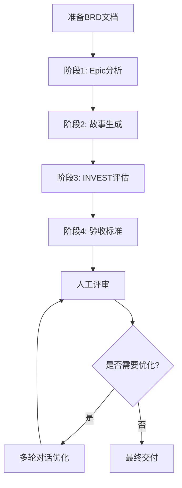
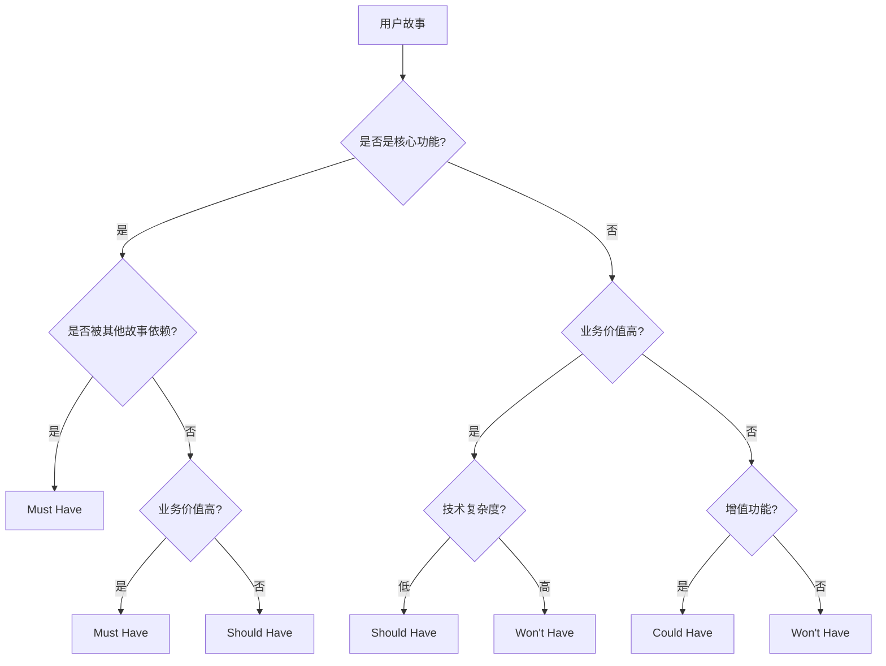
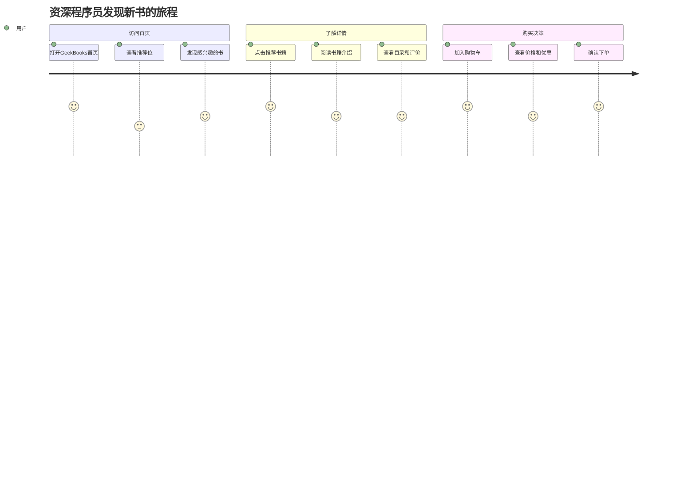

# 用户故事拆解 - 五维能力培养指南

> **📌 文档目的**: 指导学员通过用户故事拆解演练，系统性培养AI辅助敏捷需求分解的五维能力

---

## 🎯 五维能力概览

| 能力维度 | 难度 | 培养重点 | 本演练目标 |
|---------|-----|---------|-----------|
| 提示词工程 | ⭐⭐⭐⭐ | 4阶段提示词设计 | 掌握Epic分析、故事生成、INVEST评估、验收标准的提示词模板 |
| 工具链整合 | ⭐⭐⭐⭐⭐ | AI辅助敏捷需求分解 | 使用AI工具完成Epic→Story→验收标准的完整工作流 |
| 质量把控 | ⭐⭐⭐⭐⭐ | INVEST原则与MoSCoW | 确保故事质量（INVEST≥80分）、优先级合理、验收标准可测试 |
| 场景识别 | ⭐⭐⭐⭐ | 用户角色与场景分析 | 识别用户角色、使用场景、故事粒度控制 |
| 团队协作 | ⭐⭐⭐⭐ | 敏捷团队协作 | 理解PO、开发、测试、Scrum Master的协作机制 |

---

## 1️⃣ 提示词工程能力培养（⭐⭐⭐⭐）

### 1.1 能力目标

- 掌握4阶段提示词设计（Epic分析、故事生成、INVEST评估、验收标准）
- 学会设计多阶段提示词的上下文传递
- 理解如何通过提示词确保输出质量（格式规范、量化指标）

### 1.2 关键技能

#### 技能A：理解4阶段提示词的递进关系

**阶段递进关系**：

```
阶段1（Epic分析）
   ↓ 输出：Epic概述、拆解策略、用户角色
阶段2（故事生成）
   ↓ 输出：用户故事列表（10-15个）
阶段3（INVEST评估）
   ↓ 输出：评估表 + MoSCoW优先级
阶段4（验收标准）
   ↓ 输出：Given-When-Then验收标准（3-5个故事）
```

**练习**：对照 `05-用户故事拆解提示词_通用版.md`，识别4个阶段的输入输出关系

| 阶段 | 输入 | 输出 | 为什么需要这个阶段 |
|-----|------|------|------------------|
| 阶段1：Epic分析 | BRD文档 | Epic概述、拆解策略、用户角色 | 制定拆解策略，避免盲目拆分 |
| 阶段2：故事生成 | Epic分析结果 | 用户故事列表（10-15个） | 生成可迭代交付的故事 |
| 阶段3：INVEST评估 | 用户故事列表 | INVEST评估表 + MoSCoW优先级 | 确保故事质量和优先级合理 |
| 阶段4：验收标准 | 高优先级故事 | Given-When-Then验收标准 | 明确验收标准，指导测试 |

**反思问题**：
- ❓ 为什么要先做Epic分析，而不是直接生成用户故事？
- ❓ 如果跳过INVEST评估，直接编写验收标准，会有什么问题？

#### 技能B：掌握用户故事的标准格式

**标准格式**：
```
作为 <用户角色>
我希望 <功能描述>
以便 <业务价值>
```

**练习**：判断以下故事是否符合标准格式

❌ **错误示例1**（缺少用户角色）:
```
我希望首页能展示推荐书籍，以便提升点击率。
```

❌ **错误示例2**（缺少业务价值）:
```
作为用户，我希望首页能展示推荐书籍。
```

❌ **错误示例3**（技术导向，非用户导向）:
```
作为开发者，我希望实现推荐算法，以便完成任务。
```

✅ **正确示例**:
```
作为资深程序员，我希望首页能展示基于我浏览历史的个性化推荐书籍，
以便快速发现我感兴趣的新技术书籍。
```

**反思问题**：
- ❓ 为什么用户故事要强调"用户角色"和"业务价值"？
- ❓ 如何判断一个故事是"用户导向"还是"技术导向"？

#### 技能C：设计4阶段提示词的关键要素

**阶段1提示词设计要点**（Epic分析）：

```markdown
# 提示词结构

## 输入
- BRD文档（完整粘贴）

## 输出要求
1. Epic概述（名称、业务价值、用户角色、功能领域）
2. 拆解策略（拆解维度、预估故事数量、依赖关系、风险点）
3. 用户角色分析（表格：角色、描述、目标、场景）

## 质量要求
- 用户角色至少3个
- 拆解策略明确（按用户角色/功能模块/场景）
- 风险点识别至少3个
```

**阶段2提示词设计要点**（故事生成）：

```markdown
# 提示词结构

## 输入
- Epic分析结果（粘贴阶段1输出）
- 拆解策略（从阶段1提取）

## 输出要求
1. 用户故事列表（10-15个）
2. 故事格式：作为...我希望...以便...
3. 功能分组（按模块或角色分组）

## 质量要求
- 每个故事有功能要点和业务规则
- 故事粒度：1-2周开发工作量
- 覆盖主要用户角色和场景
```

**阶段3提示词设计要点**（INVEST评估）：

```markdown
# 提示词结构

## 输入
- 用户故事列表（粘贴阶段2输出）

## 输出要求
1. INVEST评估表（I-N-V-E-S-T 6个维度）
2. 综合评分（满分100分）
3. MoSCoW优先级分类（Must/Should/Could/Won't）
4. 改进建议

## 质量要求
- 评估客观（基于明确标准）
- Must Have至少6个故事
- 优先级分类说明理由
```

**阶段4提示词设计要点**（验收标准）：

```markdown
# 提示词结构

## 输入
- 高优先级故事（从阶段3的Must Have中选择3-5个）

## 输出要求
1. Given-When-Then验收标准（至少3条/故事）
2. 边界条件（异常情况处理）
3. 性能要求（响应时间、并发数）
4. UI/UX要求（界面元素、交互行为）

## 质量要求
- 所有标准可测试
- 使用量化指标（<300ms、≥99%）
- 覆盖正常+异常流程
```

---

### 1.3 实战演练

**任务**：使用 `05-用户故事拆解提示词_通用版.md` 拆解GeekBooks智能推荐Epic

**步骤**：
1. **阶段1**：使用Epic分析提示词，分析GeekBooks智能推荐Epic
2. **阶段2**：基于分析结果，生成10-15个用户故事
3. **阶段3**：对故事进行INVEST评估和MoSCoW优先级排序
4. **阶段4**：为3个Must Have故事编写验收标准

**验收标准**：
- ✅ 4个阶段依次完成，有明确的上下文传递
- ✅ 所有故事符合"作为...我希望...以便..."格式
- ✅ INVEST评分≥80分的故事占比≥70%
- ✅ 验收标准使用Given-When-Then格式

---

## 2️⃣ 工具链整合能力培养（⭐⭐⭐⭐⭐）**【核心】**

### 2.1 能力目标

- 掌握AI辅助敏捷需求分解的完整工作流
- 学会使用AI工具（Copilot Chat、Claude、GPT-4）完成4阶段任务
- 理解多轮对话优化故事质量的技巧

### 2.2 关键技能

#### 技能A：AI辅助用户故事拆解工作流（7步法）



**工作流详细步骤**：

| 步骤 | 工具 | 关键动作 | 输出 | 时长 |
|-----|------|---------|------|------|
| 1. 准备BRD | VS Code | 整理BRD文档 | Markdown文件 | 2分钟 |
| 2. 阶段1: Epic分析 | Copilot Chat | 执行Epic分析提示词 | Epic概述、拆解策略、用户角色 | 2分钟 |
| 3. 阶段2: 故事生成 | Copilot Chat | 执行故事生成提示词 | 用户故事列表（10-15个） | 3分钟 |
| 4. 阶段3: INVEST评估 | Copilot Chat | 执行INVEST评估提示词 | 评估表 + MoSCoW优先级 | 2分钟 |
| 5. 阶段4: 验收标准 | Copilot Chat | 执行验收标准提示词 | Given-When-Then标准 | 3分钟 |
| 6. 人工评审 | 人工 | 检查质量（INVEST、优先级、验收标准） | 问题清单 | 3分钟 |
| 7. 多轮优化 | Copilot Chat | 针对问题追问优化 | 优化后的故事 | 5分钟 |

**总时长**：约20分钟（含优化）

#### 技能B：多轮对话优化技巧

**场景1：故事格式不规范**

❌ **初版故事**（AI生成的格式错误）:
```
US001: 首页推荐
- 用户希望看到推荐书籍
```

✅ **优化提示**（追问）:
```
"US001格式不符合标准，请改为'作为...我希望...以便...'格式，并明确用户角色和业务价值。"
```

✅ **优化后故事**:
```
US001: 首页个性化推荐展示
- 故事描述：作为资深程序员，我希望首页能展示基于我浏览历史的个性化推荐书籍，
  以便快速发现我感兴趣的新技术书籍
```

**场景2：故事粒度过大**

❌ **初版故事**（粒度过大）:
```
US005: 完整的推荐系统
- 故事描述：作为用户，我希望有一个完整的推荐系统，包含算法、展示、埋点、A/B测试，
  以便获得个性化体验
```

✅ **优化提示**:
```
"US005粒度过大（>2周工作量），请拆分为3-4个独立故事：
1. 推荐算法
2. 推荐位展示
3. 推荐埋点
4. A/B测试（可选，Won't Have）"
```

✅ **优化后故事**:
```
US005: 推荐算法实现
- 故事描述：作为资深程序员，我希望系统能基于协同过滤算法生成推荐列表，
  以便看到与我兴趣相关的书籍

US006: 推荐位展示
- 故事描述：作为用户，我希望首页推荐位能清晰展示推荐书籍（封面、标题、价格、评分），
  以便快速浏览

US007: 推荐点击埋点
- 故事描述：作为产品经理，我希望记录用户点击推荐位的行为，
  以便分析推荐效果
```

**场景3：INVEST评分过低**

❌ **初版评估**（独立性评分低）:
```
| 故事ID | I独立性 | 综合评分 | 改进建议 |
|--------|---------|----------|----------|
| US006 | ✗ | 65/100 | 依赖US005推荐算法 |
```

✅ **优化提示**:
```
"US006独立性评分低，依赖US005。请调整故事，使US006可以独立开发（如先展示静态推荐，后接入算法）。"
```

✅ **优化后故事**:
```
US006: 推荐位展示（静态数据）
- 故事描述：作为用户，我希望首页推荐位能展示书籍列表（初期展示静态配置的热门书籍），
  以便快速浏览
- 功能要点：
  - 推荐位展示3-5本书
  - 初期使用静态配置（JSON文件），后期接入推荐算法
  - 展示封面、标题、价格、评分
- 备注：独立开发，不依赖US005推荐算法
```

**场景4：验收标准不可测试**

❌ **初版验收标准**（模糊表达）:
```
验收标准：
1. 推荐效果好
2. 性能优秀
3. 用户满意
```

✅ **优化提示**:
```
"验收标准不可测试（'效果好''优秀''满意'是主观表达），请改为量化指标：
1. 推荐点击率≥30%
2. 首页加载时间P95<500ms
3. 用户满意度调研≥4.0分（5分制）"
```

✅ **优化后验收标准**:
```
验收标准：
1. Given 用户有浏览历史
   When 用户访问首页
   Then 推荐点击率≥30%（连续7天平均值）

2. Given 推荐服务正常运行
   When 用户访问首页
   Then 首页加载时间P95<500ms

3. Given 上线后30天
   When 进行用户满意度调研
   Then 满意度≥4.0分（5分制，样本量≥100）
```

#### 技能C：工具选择与协作

**工具选择建议**：

| 工具 | 适用场景 | 优势 | 限制 |
|-----|---------|------|------|
| **GitHub Copilot Chat** | VS Code内快速拆解 | 集成开发环境，上下文感知 | 输出长度有限（需分阶段） |
| **Claude / GPT-4** | 复杂Epic拆解 | 输出质量高，支持长文档 | 需要复制粘贴 |
| **Deepseek** | 中文场景拆解 | 中文理解好，成本低 | 英文专业术语理解稍弱 |
| **Kimi** | 长文档分析 | 支持超长文本（200万字） | 生成格式需人工调整 |

**工具协作策略**：

```
阶段1-2（Epic分析 + 故事生成）
   ↓ 使用 Claude/GPT-4（需要长文本输出）
阶段3-4（INVEST评估 + 验收标准）
   ↓ 使用 Copilot Chat（快速迭代优化）
人工评审
   ↓ 使用 VS Code（对比BRD，检查遗漏）
多轮优化
   ↓ 使用 Copilot Chat（快速追问）
```

---

### 2.3 实战演练

**任务**：使用AI工具完成GeekBooks智能推荐Epic的4阶段拆解，并通过多轮对话优化

**步骤**：
1. 使用Claude/GPT-4完成阶段1-2（Epic分析 + 故事生成）
2. 使用Copilot Chat完成阶段3-4（INVEST评估 + 验收标准）
3. 人工评审：检查故事格式、INVEST评分、验收标准
4. 多轮对话优化：修复至少3个质量问题
5. 保存最终结果到 `演练/需求开发与管理/outputs/用户故事-GeekBooks智能推荐.md`

**验收标准**：
- ✅ 经过至少3轮对话优化
- ✅ 所有故事INVEST评分≥80分
- ✅ Must Have故事有完整的验收标准

---

## 3️⃣ 质量把控能力培养（⭐⭐⭐⭐⭐）**【核心】**

### 3.1 能力目标

- 掌握INVEST原则的6个维度评估方法
- 学会MoSCoW优先级排序的决策逻辑
- 建立"可测试性"思维（验收标准量化）

### 3.2 关键技能

#### 技能A：INVEST原则的6个维度评估

**INVEST评估清单**（逐项检查）：

| 维度 | 评估问题 | 通过标准 | 不通过示例 |
|-----|---------|---------|-----------|
| **I - Independent（独立性）** | 是否可以独立开发和部署？ | 不依赖其他故事，或依赖关系最小 | ❌ US006必须等US005完成才能开发 |
| **N - Negotiable（可协商）** | 需求细节是否可以调整？ | 描述目标而非规定实现 | ❌ "必须使用TensorFlow实现推荐算法" |
| **V - Valuable（有价值）** | 是否为用户带来明确价值？ | 业务价值清晰，用户需要 | ❌ "作为开发者，我希望重构代码" |
| **E - Estimable（可估算）** | 工作量是否可以评估？ | 需求清晰，技术熟悉，复杂度可控 | ❌ "实现一个智能推荐系统"（太模糊） |
| **S - Small（小粒度）** | 是否能在一个迭代内完成？ | 1-2周工作量（3-8 Story Points） | ❌ "完整的推荐系统"（>2周） |
| **T - Testable（可测试）** | 是否有明确的验收标准？ | 验收标准清晰可测试 | ❌ "推荐效果好"（主观表达） |

**练习**：评估以下故事的INVEST得分

**故事1**：
```
作为用户，我希望首页能展示基于我浏览历史的个性化推荐书籍，
以便快速发现我感兴趣的新技术书籍。

功能要点：
- 推荐位展示3-5本书
- 推荐基于协同过滤算法
- 推荐服务P95延迟<300ms
```

**评估结果**：
- I独立性：✓（可独立开发）
- N可协商：✓（未规定具体算法实现）
- V有价值：✓（用户价值明确）
- E可估算：✓（需求清晰，技术可行）
- S小粒度：✓（1-2周完成）
- T可测试：✓（有延迟指标）
- **综合评分**：95/100

**故事2**：
```
作为开发者，我希望实现一个完整的智能推荐系统，包含算法、展示、埋点、A/B测试，
以便完成Sprint目标。
```

**评估结果**：
- I独立性：✓
- N可协商：✓
- V有价值：✗（开发者视角，非用户价值）
- E可估算：✗（太大，无法估算）
- S小粒度：✗（>2周，需要拆分）
- T可测试：✗（无验收标准）
- **综合评分**：35/100（不合格）

#### 技能B：MoSCoW优先级排序的决策逻辑

**MoSCoW决策矩阵**：

| 优先级 | 业务价值 | 技术依赖 | 风险等级 | 示例（GeekBooks智能推荐） |
|-------|---------|---------|---------|------------------------|
| **Must Have** | 高 | 被其他故事依赖 | P0-P1 | US001首页推荐展示、US003降级策略 |
| **Should Have** | 中-高 | 可独立开发 | P1-P2 | US006基于分类推荐、US008性能优化 |
| **Could Have** | 中 | 可独立开发 | P2-P3 | US010推荐理由展示、US012收藏功能 |
| **Won't Have** | 低或复杂度高 | 复杂依赖 | P3-P4 | US007 A/B测试、US015跨类目推荐 |

**决策流程图**：



**练习**：为以下故事分配优先级

| 故事 | 业务价值 | 技术依赖 | 复杂度 | 优先级判定 | 理由 |
|-----|---------|---------|--------|-----------|------|
| US001: 首页推荐展示 | 高 | 被US004/US005依赖 | 中 | **Must Have** | 核心功能 + 被依赖 |
| US003: 降级策略 | 高 | 无 | 低 | **Must Have** | 保障可用性 |
| US006: 基于分类推荐 | 中 | 依赖US001 | 中 | **Should Have** | 提升精准度，非MVP必需 |
| US007: A/B测试 | 中 | 需要A/B测试平台 | 高 | **Won't Have** | 复杂度高，延后 |
| US010: 推荐理由展示 | 低 | 无 | 低 | **Could Have** | 增值功能，优先级低 |

#### 技能C：建立"可测试性"思维

**可测试性评估标准**：

| 标准 | 通过示例 | 不通过示例 |
|-----|---------|-----------|
| **使用量化指标** | ✅ "推荐点击率≥30%" | ❌ "推荐效果好" |
| **Given-When-Then格式** | ✅ "Given用户有历史 When访问首页 Then展示推荐" | ❌ "用户能看到推荐" |
| **明确验证方法** | ✅ "连续7天点击率≥30%" | ❌ "用户满意" |
| **覆盖异常场景** | ✅ "推荐服务超时时降级到热门图书" | ❌ "推荐服务正常工作" |

**量化指标转换练习**：

| 主观表达 | 量化改写 |
|---------|---------|
| ❌ 推荐效果好 | ✅ 推荐点击率≥30%（行业基准20%） |
| ❌ 加载速度快 | ✅ 首页加载时间P95<500ms |
| ❌ 系统稳定 | ✅ 推荐服务可用率≥99.5% |
| ❌ 用户满意 | ✅ 用户满意度调研≥4.0分（5分制，样本量≥100） |
| ❌ 推荐精准 | ✅ 推荐书籍与用户兴趣相关度≥70%（基于分类匹配） |

---

### 3.3 实战演练

**任务**：评审AI生成的用户故事，识别并修复至少5个质量问题

**步骤**：
1. 使用AI工具生成GeekBooks智能推荐的用户故事列表
2. 使用INVEST评估清单逐项检查每个故事
3. 记录发现的问题（格式不规范？粒度过大？优先级不合理？验收标准不可测试？）
4. 通过多轮对话修复所有INVEST评分<80分的故事
5. 确保Must Have故事有完整的Given-When-Then验收标准

**验收标准**：
- ✅ 识别并修复至少5个质量问题
- ✅ 所有故事INVEST评分≥80分
- ✅ MoSCoW优先级分类合理（Must Have覆盖核心功能）
- ✅ Must Have故事的验收标准都可测试

---

## 4️⃣ 场景识别能力培养（⭐⭐⭐⭐）

### 4.1 能力目标

- 掌握用户角色识别方法（基于用户画像）
- 学会从用户旅程中提取使用场景
- 理解故事粒度控制的原则

### 4.2 关键技能

#### 技能A：用户角色识别方法

**从BRD用户画像提取用户角色**：

**BRD用户画像示例**（GeekBooks）：
```markdown
## 用户画像

- 资深程序员（40%）：5年+经验，关注新技术，月均消费500+
- 初级程序员（30%）：1-3年经验，学习为主，价格敏感
- 技术经理（20%）：管理岗，关注团队成长，预算充足
```

**用户角色分析表**：

| 用户角色 | 占比 | 核心特征 | 痛点 | 期望 | 关键场景 |
|---------|-----|---------|------|------|---------|
| 资深程序员 | 40% | 5年+经验，月均500+ | 首页推荐不相关，浪费时间 | 精准推荐感兴趣的新书 | 访问首页→浏览推荐→点击详情→购买 |
| 初级程序员 | 30% | 1-3年经验，价格敏感 | 不知道买什么书，选择困难 | 推荐适合当前水平的书 | 访问首页→查看推荐→对比价格→犹豫→离开 |
| 技术经理 | 20% | 管理岗，预算充足 | 批量采购书籍效率低 | 推荐团队适合的书单 | 访问首页→查看推荐书单→批量加购→下单 |

**用户角色 → 用户故事映射**：

```
资深程序员 → US001: 首页个性化推荐展示
             US006: 基于分类的推荐
             US010: 推荐理由展示

初级程序员 → US002: 新用户热门推荐
             US011: 推荐书籍难度标签

技术经理   → US013: 推荐书单功能
             US014: 批量加购功能
```

#### 技能B：从用户旅程中提取使用场景

**用户旅程映射**（资深程序员）：



**使用场景提取**（从用户旅程）：

| 场景名称 | 触发条件 | 用户目标 | 操作流程 | 对应用户故事 |
|---------|---------|---------|---------|-------------|
| 场景1：首页浏览推荐 | 用户访问首页 | 快速发现感兴趣的书 | 打开首页 → 查看推荐位 → 浏览书籍 | US001 |
| 场景2：点击推荐详情 | 用户看到感兴趣的推荐 | 了解书籍详细信息 | 点击推荐 → 查看详情 → 阅读介绍 | US004 |
| 场景3：推荐失败降级 | 推荐服务超时 | 仍能看到推荐内容 | 超时触发 → 读取缓存 → 展示热门 | US003 |

#### 技能C：故事粒度控制

**粒度控制三原则**：

1. **时间原则**：1-2周开发工作量（3-8 Story Points）
2. **价值原则**：有独立的用户价值（可独立交付）
3. **测试原则**：有明确的验收标准（可测试）

**粒度判断表**：

| 判断标准 | 太大（需拆分） | 合适 | 太小（需合并） |
|---------|---------------|------|---------------|
| 开发时长 | >2周 | 1-2周 | <1天 |
| Story Points | >8 SP | 3-8 SP | <2 SP |
| 功能模块 | 多个模块 | 单一模块 | 部分功能 |
| 用户价值 | 多个价值点 | 单一价值点 | 无独立价值 |
| 验收标准 | >10条 | 3-8条 | <2条 |

**粒度调整示例**：

❌ **太大的故事**（需拆分）:
```
US005: 完整的推荐系统
- 包含：推荐算法、推荐位展示、埋点、A/B测试、推荐理由
- 工作量：4周
- Story Points：13 SP
```

✅ **拆分后**:
```
US005: 推荐算法实现（1周，5 SP）
US006: 推荐位展示（0.5周，3 SP）
US007: 推荐埋点记录（0.5周，2 SP）
US015: A/B测试（延后到下一个Sprint）
```

❌ **太小的故事**（需合并）:
```
US010: 点击推荐位按钮（0.5天，1 SP）
US011: 跳转详情页（0.5天，1 SP）
```

✅ **合并后**:
```
US004: 推荐书籍点击跳转（1天，2 SP）
- 功能要点：点击推荐位 → 跳转详情页 → 加载书籍信息
```

---

### 4.3 实战演练

**任务**：基于GeekBooks的3个用户角色，识别使用场景并生成用户故事

**步骤**：
1. 分析BRD中的3个用户画像（资深程序员、初级程序员、技术经理）
2. 为每个用户角色绘制用户旅程（访问首页 → 浏览推荐 → 点击详情 → 购买）
3. 从用户旅程中提取使用场景（至少3个场景/角色）
4. 为每个场景生成对应的用户故事（确保故事粒度合适）
5. 检查故事粒度（使用粒度判断表）

**验收标准**：
- ✅ 3个用户角色都有对应的用户故事
- ✅ 从用户旅程中提取至少9个场景
- ✅ 所有故事粒度合适（1-2周，3-8 SP）

---

## 5️⃣ 团队协作能力培养（⭐⭐⭐⭐）

### 5.1 能力目标

- 掌握敏捷团队的角色职责（PO、开发、测试、Scrum Master）
- 学会Story Refinement会议的组织方法
- 理解Sprint Planning中的故事优先级排序

### 5.2 关键技能

#### 技能A：敏捷团队角色职责

**敏捷团队角色分工**：

| 角色 | 职责 | 在用户故事拆解中的关注点 | 典型问题 |
|-----|------|----------------------|---------|
| **产品负责人（PO）** | Epic拆解、优先级排序、验收标准确认 | 业务价值、用户需求、优先级 | "这个故事的业务价值是什么？" |
| **开发团队** | 工作量估算、技术可行性评估、Story Points | 技术实现、依赖关系、工作量 | "这个故事需要多少Story Points？" |
| **测试团队** | 验收标准评审、可测试性评估 | 验收标准、测试用例、边界条件 | "如何验证推荐点击率≥30%？" |
| **Scrum Master** | 引导会议、解决阻碍、确保流程 | INVEST原则、故事质量、团队共识 | "这个故事是否符合INVEST原则？" |
| **UX设计师** | 用户体验评审、交互流程设计 | 用户旅程、交互细节、界面元素 | "推荐位的交互是否符合用户习惯？" |

#### 技能B：Story Refinement会议组织

**会议流程**（60分钟）：

| 环节 | 时长 | 参与人 | 关键动作 | 输出 |
|-----|------|-------|---------|------|
| 1. Epic讲解 | 10分钟 | PO主讲 | 讲解Epic背景、业务价值、用户角色 | Epic概述 |
| 2. 故事评审 | 30分钟 | 全员 | 逐个评审用户故事（格式、价值、粒度） | 故事清单（初版） |
| 3. INVEST评估 | 10分钟 | 全员 | 使用INVEST原则评估故事质量 | INVEST评估表 |
| 4. 优先级排序 | 5分钟 | PO主导 | 使用MoSCoW方法排序（Must/Should/Could/Won't） | 优先级列表 |
| 5. 验收标准讨论 | 5分钟 | PO + 测试 | 讨论Must Have故事的验收标准 | 验收标准（草稿） |

**会议产出**：
- ✅ 用户故事列表（10-15个，符合INVEST原则）
- ✅ MoSCoW优先级分类
- ✅ Must Have故事的验收标准（草稿）
- ✅ 待确认事项清单

#### 技能C：Sprint Planning中的故事选择

**Sprint Planning决策矩阵**：

| 决策因素 | 权重 | 评估标准 |
|---------|-----|---------|
| **业务价值** | 40% | Must Have > Should Have > Could Have |
| **技术依赖** | 30% | 被依赖的故事优先 |
| **团队容量** | 20% | Sprint容量 = 团队速率（如20-25 SP） |
| **风险等级** | 10% | 高风险故事提前做（留时间应对） |

**Sprint Planning流程**（以GeekBooks为例）：

```
Sprint容量：20 SP（团队速率）

Must Have故事：
- US001: 首页推荐展示（5 SP）
- US002: 新用户推荐（3 SP）
- US003: 降级策略（3 SP）
- US004: 推荐点击跳转（2 SP）
- US005: 推荐埋点记录（2 SP）

总计：15 SP（在容量内）

Should Have故事（剩余5 SP）：
- US006: 基于分类推荐（5 SP）

本Sprint承诺：US001-US006（共20 SP）
延后到下一个Sprint：US007-US015
```

**决策原则**：
- ✅ Must Have故事优先
- ✅ 被依赖的故事优先
- ✅ 总Story Points不超过团队速率
- ✅ 预留10-20%缓冲（应对风险）

---

### 5.3 实战演练

**任务**：模拟Story Refinement会议，角色扮演

**角色分配**（每组4-5人）：
- 产品负责人（1人）：讲解Epic，排序优先级
- 开发（1-2人）：评估工作量，估算Story Points
- 测试（1人）：评审验收标准
- Scrum Master（1人）：引导会议，检查INVEST

**步骤**：
1. PO讲解GeekBooks智能推荐Epic（5分钟）
2. 全员评审用户故事列表（15分钟）
3. 开发团队估算Story Points（5分钟）
4. Scrum Master引导INVEST评估（5分钟）
5. PO排序MoSCoW优先级（5分钟）
6. 测试评审Must Have故事的验收标准（5分钟）

**验收标准**：
- ✅ 所有故事通过INVEST评估（评分≥80分）
- ✅ MoSCoW优先级分类明确
- ✅ Must Have故事有完整的验收标准
- ✅ 记录至少3个待确认事项

---

## 📋 五维能力自检清单

完成用户故事拆解演练后，使用以下清单自检：

### 提示词工程（⭐⭐⭐⭐）
- [ ] ✅ 理解4阶段提示词的递进关系
- [ ] ✅ 掌握用户故事的标准格式（作为...我希望...以便...）
- [ ] ✅ 学会设计4阶段提示词的输入输出结构

### 工具链整合（⭐⭐⭐⭐⭐）**【核心】**
- [ ] ✅ 掌握AI辅助敏捷需求分解的7步工作流
- [ ] ✅ 学会多轮对话优化故事质量（至少3轮）
- [ ] ✅ 熟悉工具选择（Copilot Chat、Claude、GPT-4）

### 质量把控（⭐⭐⭐⭐⭐）**【核心】**
- [ ] ✅ 掌握INVEST原则的6个维度评估方法
- [ ] ✅ 学会MoSCoW优先级排序的决策逻辑
- [ ] ✅ 建立"可测试性"思维（量化指标、Given-When-Then）

### 场景识别（⭐⭐⭐⭐）
- [ ] ✅ 掌握用户角色识别方法（基于用户画像）
- [ ] ✅ 学会从用户旅程中提取使用场景
- [ ] ✅ 理解故事粒度控制的三原则

### 团队协作（⭐⭐⭐⭐）
- [ ] ✅ 理解敏捷团队角色职责（PO、开发、测试、Scrum Master）
- [ ] ✅ 掌握Story Refinement会议组织方法
- [ ] ✅ 学会Sprint Planning中的故事选择决策

---

## 🎯 进阶挑战

完成基础演练后，尝试以下进阶挑战：

### 挑战1：Story Mapping生成
- 使用Mermaid生成用户故事地图（User Story Mapping）
- 展示用户旅程和故事的映射关系

### 挑战2：提示词模板定制
- 基于 `05-用户故事拆解提示词_通用版.md`，定制你所在企业的提示词模板
- 添加企业特有的质量要求（如安全合规、成本控制）

### 挑战3：跨团队协作演练
- 模拟跨团队Epic拆解（如推荐系统团队 + 前端团队 + 测试团队）
- 重点练习依赖管理和接口职责划分

---

**文档结束**
