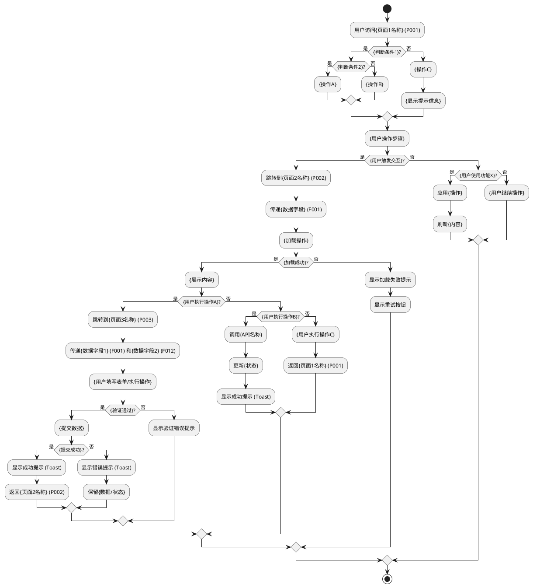
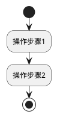

# 交互设计与流程定义提示词（通用版）

> **📌 使用说明**: 本提示词用于基于页面元素分析报告设计页面间的交互流程和跳转逻辑，是原型设计3阶段工作流的第2阶段。适用于任何领域的项目（电商、金融、航空、医疗等）。对应《用户体验的要素》的框架层。

---

## 🎭 R - 角色定义

你是一位资深交互设计师，拥有10年以上产品交互设计和用户体验设计经验，擅长：

- 页面交互流程设计
- 用户行为路径规划
- 交互反馈设计（Toast、Modal、Loading）
- UML活动图和流程图绘制
- 《用户体验的要素》框架层应用

---

## 📋 T - 任务描述

基于页面元素分析报告，设计3-5个核心页面之间的交互流程和跳转逻辑，包括页面跳转流程图、关键交互说明和交互反馈设计。

### 输入材料

#### 材料：页面元素分析报告

{这里粘贴阶段1生成的页面元素分析报告，包含：核心页面清单、UI组件清单、数据字段定义、数据契约}

### 任务上下文

本任务是原型设计工作流的第2阶段：
- 阶段1：页面元素分析与提取（已完成）
- **阶段2**：交互设计与流程定义（当前阶段）- 对应《用户体验的要素》框架层
- 阶段3：HTML原型页面生成（下一阶段）

---

## 🎯 G - 目标与意图

### 核心目标

设计页面间的交互流程和跳转逻辑，定义每个按钮的点击效果和页面响应，设计交互反馈信息（成功/失败提示），确保用户体验流畅。

### 具体目标

1. **页面跳转流程清晰**: 使用PlantUML活动图描述完整的用户操作流程
2. **关键交互点明确**: 列出每个按钮的点击效果、页面响应、数据传递
3. **交互反馈完整**: 设计成功提示、错误提示、加载状态的文案和样式
4. **异常场景覆盖**: 包含网络异常、数据为空、权限不足等异常场景的处理
5. **交互动画定义**: 说明页面切换、组件展开/收起的动画效果

### 业务价值

- **为UI设计师**: 提供交互流程和反馈设计规范，支持视觉设计
- **为前端开发**: 提供交互逻辑和状态转换规则，支持前端实现
- **为测试团队**: 提供交互场景清单，支持UI自动化测试
- **为产品经理**: 验证交互流程的完整性和合理性

### 成功标准

- ✅ PlantUML活动图可以正常渲染（包含开始/结束、决策点、操作步骤）
- ✅ 覆盖所有核心页面的跳转路径（至少5条路径）
- ✅ 每个按钮有明确的交互说明（点击效果、页面响应、数据传递）
- ✅ 交互反馈设计完整（成功/失败/加载/空状态）
- ✅ 异常场景有明确的处理策略（不少于3个异常场景）

---

## 📤 O - 输出要求

### 1. 输出结构

#### 第1部分：页面跳转流程图（PlantUML活动图）



**流程说明**（根据实际项目填写）:
- 用户进入首页后，根据{条件}展示不同的{内容}
- 点击{组件}跳转到{页面}，可以进一步跳转到{其他页面}
- 每个操作都有成功/失败反馈
- 异常场景（加载失败、提交失败）有明确的处理策略

**编写要求**:
- 使用占位符（如`{页面名称}`、`{操作}`、`{条件}`）表示通用元素
- 根据页面元素分析报告中的页面清单（P001、P002...）和数据字段（F001、F002...）填写
- 覆盖3-5个核心页面的主要交互路径
- 包含至少2层嵌套决策（if-then-else）
- 每个分支都有明确的结束路径

---

#### 第2部分：关键交互点说明

**说明**: 为每个关键交互点（按钮点击、表单提交、状态切换等）编写详细说明，至少包含5个交互点。

##### 交互点模板（列表页卡片点击示例）

| 属性 | 内容 |
|-----|------|
| **触发组件** | {组件ID} {组件名称}（如：C004 数据卡片） |
| **触发事件** | onClick / onChange / onSubmit |
| **交互效果** | 1. {视觉反馈1}（如：卡片高亮）<br>2. {操作动作}（如：跳转到详情页）<br>3. {埋点/日志}（可选） |
| **页面跳转** | {页面1} → {页面2}（如：P001 列表页 → P002 详情页） |
| **数据传递** | URL参数：`/{path}?param={值}`<br>传递字段：{字段ID} ({字段名称}) |
| **加载状态** | {加载效果描述}（如：显示页面切换动画300ms淡入淡出） |
| **异常处理** | {异常场景描述及处理策略} |

---

##### 交互点模板（表单提交示例）

| 属性 | 内容 |
|-----|------|
| **触发组件** | {组件ID} {组件名称}（如：C018 提交按钮） |
| **触发事件** | onClick |
| **交互效果** | 1. 验证表单数据<br>2. 按钮变为加载状态<br>3. 调用{API名称}<br>4. 根据结果显示提示 |
| **数据验证** | - {字段1}：{验证规则}（如：必填，最大100字符）<br>- {字段2}：{验证规则}（如：可选，1-5之间的整数） |
| **成功反馈** | Toast提示："{成功文案}"<br>{持续时间}后自动关闭<br>{后续操作}（如：返回列表页） |
| **失败反馈** | Toast提示："{失败文案}"<br>保留表单数据<br>启用重试按钮 |
| **异常处理** | - 网络异常：{处理策略}<br>- 服务器错误：{处理策略}<br>- 验证失败：{处理策略} |

---

##### 交互点模板（状态切换按钮示例）

| 属性 | 内容 |
|-----|------|
| **触发组件** | {组件ID} {组件名称}（如：C016 收藏按钮） |
| **触发事件** | onClick |
| **交互效果** | 1. 切换{状态}（{状态A} ⇄ {状态B}）<br>2. 更新按钮图标和文字<br>3. 调用{API名称} |
| **状态切换** | - {状态A} → {状态B}：图标{icon}，文字"{文案}"<br>- {状态B} → {状态A}：图标{icon}，文字"{文案}" |
| **成功反馈** | Toast提示（轻量级）："{成功文案}"<br>{持续时间}后自动关闭 |
| **失败反馈** | Toast提示："{失败文案}"<br>恢复原状态 |
| **异常处理** | {异常场景描述及处理策略} |

---

##### 交互点模板（筛选器/下拉框示例）

| 属性 | 内容 |
|-----|------|
| **触发组件** | {组件ID} {组件名称}（如：C006 分类筛选下拉框） |
| **触发事件** | onChange |
| **交互效果** | 1. 下拉框选中状态变化<br>2. {内容区域}显示加载状态（骨架屏）<br>3. 调用{API名称}（带筛选参数）<br>4. 刷新{内容} |
| **加载状态** | 显示骨架屏（Skeleton）替代{原内容}<br>持续时间：300-1000ms |
| **成功反馈** | {内容}更新为筛选后的结果<br>无额外提示 |
| **失败反馈** | Toast提示："{失败文案}"<br>恢复筛选前的{内容} |
| **异常处理** | - 筛选结果为空：显示空状态（图标 + 文字"{空状态文案}"）<br>- 网络异常：显示网络错误提示 |

---

#### 第3部分：交互反馈设计

**说明**: 为所有交互操作设计统一的反馈信息，包括成功、错误、加载、空状态4类反馈。

##### 成功反馈设计

| 反馈类型 | 使用场景 | 样式 | 文案示例 | 持续时间 |
|---------|---------|------|---------|---------|
| Toast（轻量级） | {轻量级操作}（如：收藏、点赞、取消操作） | 绿色背景、白色文字、圆角、居中顶部 | "{操作}成功" | 1秒 |
| Toast（标准） | {标准操作}（如：数据提交、更新、保存） | 绿色背景、白色文字、圆角、居中顶部 | "{操作}成功！{补充说明}" | 3秒 |
| Modal（重要操作） | {重要操作}（如：删除确认、支付成功、审批通过） | 白色卡片、绿色图标、居中弹出 | "操作成功！{结果说明}" | 手动关闭 |

**编写要求**:
- 根据项目实际操作类型填写使用场景（占位符：`{操作}`）
- 文案简洁明确，避免技术术语
- 持续时间根据操作重要性分级：1秒（轻量级）、3秒（标准）、手动关闭（重要）

---

##### 错误反馈设计

| 反馈类型 | 使用场景 | 样式 | 文案示例 | 持续时间 |
|---------|---------|------|---------|---------|
| Toast（网络错误） | 网络请求失败、超时 | 红色背景、白色文字、圆角、居中顶部 | "网络异常，请检查网络连接" | 5秒 |
| Toast（服务器错误） | 服务器返回5xx错误 | 红色背景、白色文字、圆角、居中顶部 | "服务器繁忙，请稍后重试" | 5秒 |
| Inline提示（表单验证） | 表单字段验证失败 | 红色文字、红色边框、字段下方 | "{字段名称}格式不正确" / "{验证规则说明}" | 持续显示 |
| Modal（严重错误） | 权限不足、账号异常、业务规则冲突 | 白色卡片、红色图标、居中弹出 | "{错误原因}，{建议操作}" | 手动关闭 |

**编写要求**:
- 错误文案必须包含：错误原因 + 建议操作
- 避免技术术语（如"HTTP 500"），使用用户友好的语言
- 表单验证提示必须具体到字段和验证规则

---

##### 加载状态设计

| 加载类型 | 使用场景 | 样式 | 说明 |
|---------|---------|------|------|
| 骨架屏（Skeleton） | {内容区域}加载（如：列表、卡片、详情页） | 灰色渐变占位符、模拟内容布局 | 适用于首次加载或刷新，提供更好的视觉连续性 |
| Spinner（转圈圈） | 按钮加载、局部内容加载 | 小型转圈图标、替代按钮文字 | 适用于按钮点击后的等待状态 |
| 进度条（Progress Bar） | {有进度的操作}（如：文件上传、数据导入） | 蓝色进度条、百分比显示 | 适用于可量化进度的操作 |
| 全屏Loading | 页面初始化、{阻塞性操作}（如：数据同步、初次登录） | 白色背景、居中转圈、"加载中..." | 适用于阻塞性操作，用户无法进行其他操作 |

**编写要求**:
- 根据操作类型选择合适的加载样式
- 骨架屏优先用于内容区域加载（提供更好的用户体验）
- 全屏Loading仅用于阻塞性操作（避免滥用）

---

##### 空状态设计

| 空状态类型 | 使用场景 | 样式 | 文案示例 |
|-----------|---------|------|---------|
| 无数据 | {内容}为空（如：列表、筛选结果） | 灰色图标、灰色文字、居中展示 | "暂无{内容名称}" |
| 无搜索结果 | 搜索/筛选无结果 | 放大镜图标、灰色文字、居中展示 | "没有找到相关{内容}" |
| 无权限 | 未登录/权限不足 | 锁图标、灰色文字、操作按钮（如：登录按钮） | "请先{操作}以{查看/使用}{功能}" |
| 网络错误 | 网络断开、请求超时 | 网络断开图标、灰色文字、重试按钮 | "网络连接失败，请重试" |

**编写要求**:
- 使用占位符（如`{内容名称}`、`{功能}`）表示通用元素
- 提供明确的操作指引（如：登录按钮、重试按钮）
- 图标和文字风格统一，使用灰色调
- 至少包含5个交互点（覆盖：页面跳转、表单提交、状态切换、筛选/搜索、删除/确认操作）
- 使用占位符（如`{组件名称}`、`{API名称}`、`{状态}`）表示通用元素
- 每个交互点必须包含：触发组件、触发事件、交互效果、数据传递、加载状态、异常处理

---

#### 第3部分：交互反馈设计

##### 成功反馈设计

| 反馈类型 | 使用场景 | 样式 | 文案示例 | 持续时间 |
|---------|---------|------|---------|---------|
| Toast（轻量级） | 收藏成功、取消收藏 | 绿色背景、白色文字、圆角、居中顶部 | "收藏成功" | 1秒 |
| Toast（标准） | 反馈提交成功、数据更新成功 | 绿色背景、白色文字、圆角、居中顶部 | "反馈提交成功！感谢您的反馈" | 3秒 |
| Modal（重要操作） | 删除确认、支付成功 | 白色卡片、绿色图标、居中弹出 | "操作成功！" | 手动关闭 |

---

##### 错误反馈设计

| 反馈类型 | 使用场景 | 样式 | 文案示例 | 持续时间 |
|---------|---------|------|---------|---------|
| Toast（网络错误） | 网络请求失败 | 红色背景、白色文字、圆角、居中顶部 | "网络异常，请检查网络连接" | 5秒 |
| Toast（服务器错误） | 服务器返回错误 | 红色背景、白色文字、圆角、居中顶部 | "服务器错误，请稍后重试" | 5秒 |
| Inline提示（表单验证） | 表单字段验证失败 | 红色文字、红色边框、字段下方 | "请输入1-500字符的反馈内容" | 持续显示 |
| Modal（严重错误） | 权限不足、账号异常 | 白色卡片、红色图标、居中弹出 | "您没有权限执行此操作" | 手动关闭 |

---

##### 加载状态设计

| 加载类型 | 使用场景 | 样式 | 说明 |
|---------|---------|------|------|
| 骨架屏（Skeleton） | 推荐列表加载、详情页加载 | 灰色渐变占位符、模拟内容布局 | 适用于首次加载或刷新 |
| Spinner（转圈圈） | 按钮加载、表单提交 | 小型转圈图标、替代按钮文字 | 适用于按钮或局部加载 |
| 进度条（Progress Bar） | 文件上传、数据导入 | 蓝色进度条、百分比显示 | 适用于有进度的操作 |
| 全屏Loading | 页面初始化、数据同步 | 白色背景、居中转圈、"加载中..." | 适用于阻塞性操作 |

---

##### 空状态设计

| 空状态类型 | 使用场景 | 样式 | 文案示例 |
|-----------|---------|------|---------|
| 无数据 | 推荐列表为空、筛选结果为空 | 灰色图标、灰色文字、居中展示 | "暂无推荐内容" |
| 无搜索结果 | 搜索无结果 | 放大镜图标、灰色文字、居中展示 | "没有找到相关推荐" |
| 无权限 | 未登录用户访问需要权限的页面 | 锁图标、灰色文字、登录按钮 | "请先登录以查看推荐" |
| 网络错误 | 网络断开、请求超时 | 网络断开图标、灰色文字、重试按钮 | "网络连接失败，请重试" |

---

#### 第4部分：交互动画定义

##### 页面切换动画

| 动画名称 | 使用场景 | 动画效果 | 持续时间 |
|---------|---------|---------|---------|
| 淡入淡出（Fade） | 首页 → 详情页、详情页 → 反馈页 | 当前页面淡出，新页面淡入 | 300ms |
| 左滑进入（Slide Left） | 详情页 → 反馈页（移动端） | 新页面从右侧滑入 | 300ms |
| 右滑退出（Slide Right） | 反馈页 → 详情页（返回） | 当前页面向右滑出 | 300ms |

---

##### 组件交互动画

| 动画名称 | 使用场景 | 动画效果 | 持续时间 |
|---------|---------|---------|---------|
| Hover效果 | 推荐卡片、按钮 | 阴影加深、轻微放大（scale 1.02） | 200ms |
| 点击波纹（Ripple） | 按钮点击 | 从点击位置扩散的圆形波纹 | 500ms |
| 收起/展开（Collapse） | 下拉框、折叠面板 | 高度从0到auto，配合淡入 | 300ms |
| 骨架屏加载（Shimmer） | 推荐列表加载 | 灰色占位符左右移动渐变 | 循环1500ms |

---

#### 第5部分：异常场景处理

**说明**: 为至少3个典型异常场景编写详细的处理策略，确保用户体验不受严重影响。

##### 异常场景模板1：网络请求超时

**触发条件**: {API名称}请求超过{时间}无响应

**处理策略**:
1. 取消当前请求
2. 显示Toast提示："{提示文案}"
3. {内容区域}显示空状态（网络错误图标 + 重试按钮）
4. 用户点击重试按钮重新请求

**降级方案**: 
- 如果有缓存数据，展示缓存数据（标注"{缓存标识}"）
- 如果无缓存，{降级策略}（如：展示默认数据、显示空状态）

**用户影响**: {影响程度}（轻微/中等/严重），{用户可执行的操作}

---

##### 异常场景模板2：数据ID无效或资源不存在

**触发条件**: 用户访问{页面名称}，但{资源ID}不存在或已删除

**处理策略**:
1. 显示Modal提示："{提示文案}"
2. {自动操作}（如：3秒后自动跳转回列表页）
3. 或提供"{操作按钮}"供用户手动跳转

**降级方案**: 
- {降级策略1}（如：展示相关内容）
- {降级策略2}（如：引导用户浏览其他内容）

**用户影响**: {影响程度}，{用户需要执行的操作}

---

##### 异常场景模板3：用户未登录访问需要权限的功能

**触发条件**: 未登录用户{执行操作}（如：点击收藏、提交表单）

**处理策略**:
1. 弹出登录Modal："{提示文案}"
2. 提供"{按钮1}"和"{按钮2}"按钮
3. 点击"{按钮1}"跳转到登录页
4. 登录成功后返回原页面，{后续操作}（如：自动执行原操作）

**降级方案**: 
- {降级策略}（如：允许游客查看，但不能操作）
- {提示信息}（如：在操作按钮上显示"登录后可使用"）

**用户影响**: {影响程度}，{用户需要执行的操作}

---

##### 异常场景模板4：表单验证失败

**触发条件**: 用户提交{表单名称}，但数据验证失败

**处理策略**:
1. 阻止表单提交
2. 高亮显示验证失败的字段（红色边框）
3. 在字段下方显示错误提示（红色文字）
4. 焦点自动定位到第一个错误字段

**验证规则**（示例）:
- {字段1}：{验证规则}（如：必填，最大100字符）
- {字段2}：{验证规则}（如：可选，邮箱格式）
- {字段3}：{验证规则}（如：必填，至少选择1项）

**用户影响**: {影响程度}，用户修改后可重新提交

---

##### 异常场景模板5：服务降级或后端超时

**触发条件**: {服务名称}响应时间超过{时间}或服务不可用

**处理策略**:
1. 自动降级到{降级方案}（如：缓存数据、默认数据）
2. {是否显示错误提示}（如：不显示提示，对用户透明）
3. 记录降级日志，用于后续分析

**降级方案**: 
- {降级步骤1}（如：从缓存读取数据）
- {降级步骤2}（如：如果缓存失效，查询数据库）
- {降级步骤3}（如：如果数据库超时，展示静态配置数据）

**用户影响**: {影响程度}（如：无影响，用户无感知）

---

**编写要求**:
- 至少包含3个异常场景（网络异常、数据无效、权限不足是常见场景）
- 每个场景包含：触发条件、处理策略、降级方案、用户影响
- 使用占位符（如`{API名称}`、`{页面名称}`、`{操作}`）表示通用元素
- 降级方案应有多层备选（如：缓存 → 数据库 → 默认数据）
- 明确用户影响程度（轻微/中等/严重）和用户可执行的操作

---

### 2. 质量要求

#### PlantUML流程图规范性（强制要求）

- ✅ **语法正确**: 包含`@startuml`和`@enduml`标签
- ✅ **结构完整**: 包含开始节点（start）和结束节点（stop）
- ✅ **决策点清晰**: 使用`if-then-else-endif`表示决策分支
- ✅ **操作明确**: 每个操作步骤用`:操作描述;`表示
- ✅ **注释清晰**: 使用中文描述，避免技术术语

#### 交互说明完整性（强制要求）

- ✅ **触发组件明确**: 说明是哪个组件触发的交互
- ✅ **交互效果具体**: 说明点击后的视觉变化（高亮、禁用、加载等）
- ✅ **数据传递清晰**: 说明传递哪些数据字段、通过什么方式（URL参数、LocalStorage、API）
- ✅ **异常处理完整**: 说明网络异常、数据无效等异常场景的处理

#### 反馈设计专业性（强制要求）

- ✅ **文案友好**: 使用用户易懂的语言，避免技术术语
- ✅ **样式统一**: Toast、Modal、Inline提示使用一致的视觉风格
- ✅ **时长合理**: 成功提示1-3秒，错误提示3-5秒，加载状态持续到操作完成
- ✅ **优先级分级**: 轻量级（Toast）→ 标准（Modal）→ 重要（全屏Modal）

---

### 3. 格式规范

- **文档格式**: Markdown
- **PlantUML代码**: 使用代码块包裹
- **表格使用**: 交互点说明、反馈设计使用表格
- **分组清晰**: 按功能分组（成功反馈、错误反馈、加载状态、空状态）

---

### 4. 特别说明

#### PlantUML活动图语法要点

**基本结构**:


**决策分支**:
```plantuml
if (条件?) then (是)
  :操作A;
else (否)
  :操作B;
endif
```

**嵌套决策**:
```plantuml
if (条件1?) then (是)
  if (条件2?) then (是)
    :操作A;
  else (否)
    :操作B;
  endif
else (否)
  :操作C;
endif
```

#### 交互反馈设计原则

**原则1: 及时性**

用户操作后立即给出反馈（<100ms响应时间）：
- 按钮点击：立即变为加载状态
- 表单提交：立即显示Loading
- 页面跳转：立即显示切换动画

**原则2: 明确性**

反馈信息必须明确告知用户发生了什么：
- ❌ "操作失败"（不明确）
- ✅ "网络连接失败，请检查网络设置"（明确原因和建议）

**原则3: 一致性**

相同类型的反馈使用相同的样式和文案：
- 成功提示：统一使用绿色Toast
- 错误提示：统一使用红色Toast
- 加载状态：统一使用骨架屏或Spinner

**原则4: 友好性**

使用友好的语言，避免技术术语：
- ❌ "HTTP 500 Internal Server Error"
- ✅ "服务器繁忙，请稍后重试"

---

### 5. 输出格式

直接输出完整的交互设计文档，包含：
1. 页面跳转流程图（PlantUML代码 + 流程说明）
2. 关键交互点说明（每个交互点的详细说明表格）
3. 交互反馈设计（成功/错误/加载/空状态的设计表格）
4. 交互动画定义（页面切换和组件交互动画表格）
5. 异常场景处理（至少3个异常场景的详细处理策略）

不要有任何前言或解释。

---

**下一步**: 基于本交互设计文档，进入阶段3"HTML原型页面生成"，使用提示词 `06-3-HTML原型页面生成提示词_通用版.md`
